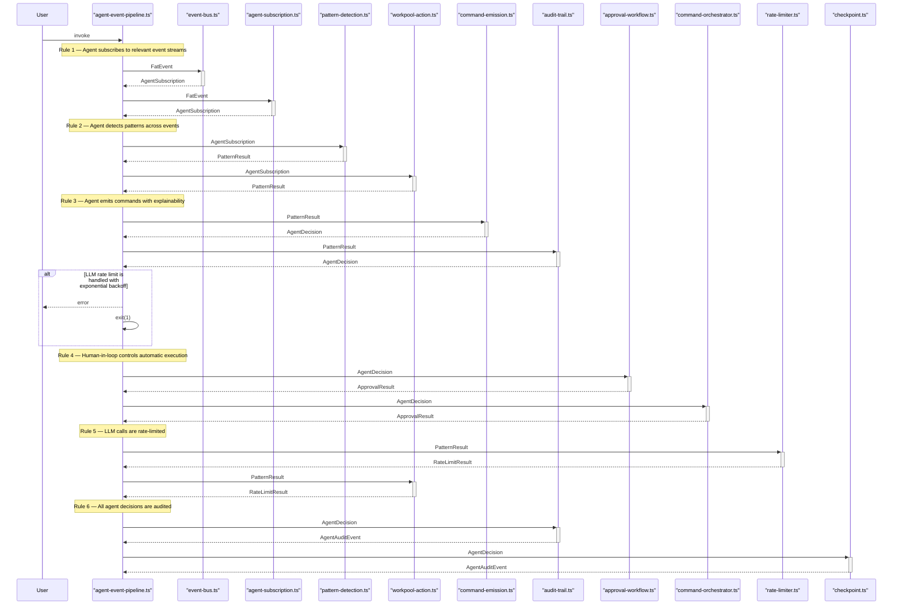
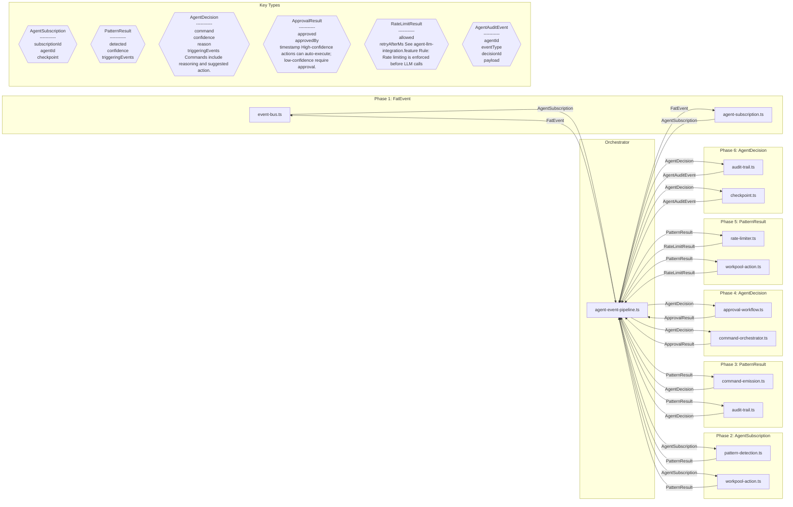

# Design Review: AgentAsBoundedContext

**Purpose:** Auto-generated design review with sequence and component diagrams
**Detail Level:** Design review artifact from sequence annotations

---

**Pattern:** AgentAsBoundedContext | **Phase:** Phase 22 | **Status:** completed | **Orchestrator:** agent-event-pipeline | **Steps:** 6 | **Participants:** 11

**Source:** `libar-platform/architect/specs/platform/agent-as-bounded-context.feature`

---

## Annotation Convention

This design review is generated from the following annotations:

| Tag                   | Level    | Format | Purpose                            |
| --------------------- | -------- | ------ | ---------------------------------- |
| sequence-orchestrator | Feature  | value  | Identifies the coordinator module  |
| sequence-step         | Rule     | number | Explicit execution ordering        |
| sequence-module       | Rule     | csv    | Maps Rule to deliverable module(s) |
| sequence-error        | Scenario | flag   | Marks scenario as error/alt path   |

Description markers: `**Input:**` and `**Output:**` in Rule descriptions define data flow types for sequence diagram call arrows and component diagram edges.

---

## Sequence Diagram — Runtime Interaction Flow

Generated from: `@architect-sequence-step`, `@architect-sequence-module`, `@architect-sequence-error`, `**Input:**`/`**Output:**` markers, and `@architect-sequence-orchestrator` on the Feature.

---

## Component Diagram — Types and Data Flow

Generated from: `@architect-sequence-module` (nodes), `**Input:**`/`**Output:**` (edges and type shapes), deliverables table (locations), and `sequence-step` (grouping).

---

## Key Type Definitions

| Type                | Fields                                                                                                     | Produced By                             | Consumed By                                                      |
| ------------------- | ---------------------------------------------------------------------------------------------------------- | --------------------------------------- | ---------------------------------------------------------------- |
| `AgentSubscription` | subscriptionId, agentId, checkpoint                                                                        | event-bus, agent-subscription           | pattern-detection, workpool-action                               |
| `PatternResult`     | detected, confidence, triggeringEvents                                                                     | pattern-detection, workpool-action      | command-emission, audit-trail, rate-limiter, workpool-action     |
| `AgentDecision`     | command, confidence, reason, triggeringEvents Commands include reasoning and suggested action.             | command-emission, audit-trail           | approval-workflow, command-orchestrator, audit-trail, checkpoint |
| `ApprovalResult`    | approved, approvedBy, timestamp High-confidence actions can auto-execute; low-confidence require approval. | approval-workflow, command-orchestrator |                                                                  |
| `RateLimitResult`   | allowed, retryAfterMs See agent-llm-integration.feature Rule: Rate limiting is enforced before LLM calls   | rate-limiter, workpool-action           |                                                                  |
| `AgentAuditEvent`   | agentId, eventType, decisionId, payload                                                                    | audit-trail, checkpoint                 |                                                                  |

---

## Design Questions

Verify these design properties against the diagrams above:

| #    | Question                             | Auto-Check                      | Diagram   |
| ---- | ------------------------------------ | ------------------------------- | --------- |
| DQ-1 | Is the execution ordering correct?   | 6 steps in monotonic order      | Sequence  |
| DQ-2 | Are all interfaces well-defined?     | 6 distinct types across 6 steps | Component |
| DQ-3 | Is error handling complete?          | 1 error paths identified        | Sequence  |
| DQ-4 | Is data flow unidirectional?         | Review component diagram edges  | Component |
| DQ-5 | Does validation prove the full path? | Review final step               | Both      |

---

## Findings

Record design observations from reviewing the diagrams above. Each finding should reference which diagram revealed it and its impact on the spec.

| #   | Finding                                     | Diagram Source | Impact on Spec |
| --- | ------------------------------------------- | -------------- | -------------- |
| F-1 | (Review the diagrams and add findings here) | —              | —              |

---

## Summary

The AgentAsBoundedContext design review covers 6 sequential steps across 11 participants with 6 key data types and 1 error paths.
