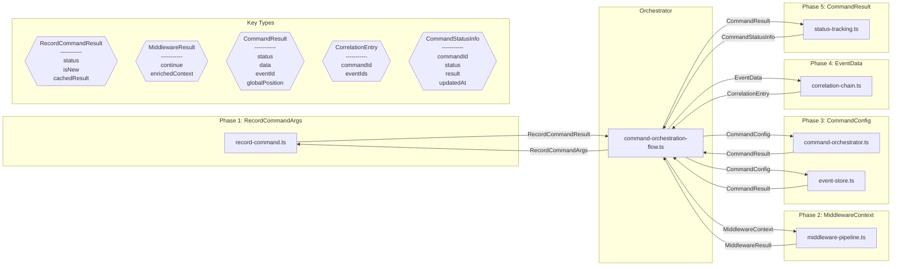

# Design Review: CommandBusFoundation

**Purpose:** Auto-generated design review with sequence and component diagrams
**Detail Level:** Design review artifact from sequence annotations

---

**Pattern:** CommandBusFoundation | **Phase:** Phase 3 | **Status:** completed | **Orchestrator:** command-orchestration-flow | **Steps:** 5 | **Participants:** 7

**Source:** `libar-platform/architect/specs/platform/command-bus-foundation.feature`

---

## Annotation Convention

This design review is generated from the following annotations:

| Tag                   | Level    | Format | Purpose                            |
| --------------------- | -------- | ------ | ---------------------------------- |
| sequence-orchestrator | Feature  | value  | Identifies the coordinator module  |
| sequence-step         | Rule     | number | Explicit execution ordering        |
| sequence-module       | Rule     | csv    | Maps Rule to deliverable module(s) |
| sequence-error        | Scenario | flag   | Marks scenario as error/alt path   |

Description markers: `**Input:**` and `**Output:**` in Rule descriptions define data flow types for sequence diagram call arrows and component diagram edges.

---

## Sequence Diagram — Runtime Interaction Flow

Generated from: `@architect-sequence-step`, `@architect-sequence-module`, `@architect-sequence-error`, `**Input:**`/`**Output:**` markers, and `@architect-sequence-orchestrator` on the Feature.

```mermaid
sequenceDiagram
    participant User
    participant command_orchestration_flow as "command-orchestration-flow.ts"
    participant record_command as "record-command.ts"
    participant middleware_pipeline as "middleware-pipeline.ts"
    participant command_orchestrator as "command-orchestrator.ts"
    participant event_store as "event-store.ts"
    participant correlation_chain as "correlation-chain.ts"
    participant status_tracking as "status-tracking.ts"

    User->>command_orchestration_flow: invoke

    Note over command_orchestration_flow: Rule 1 — Same commandId always returns same result without re-execution. Every command has a unique commandId. When a command is recorded, the Command Bus checks if that commandId already exists: - If new: Record command with status &quot;pending&quot;, proceed to execution - If duplicate: Return cached result without re-execution This ensures retries are safe - network failures don't cause duplicate domain state changes.

    command_orchestration_flow->>+record_command: RecordCommandArgs
    record_command-->>-command_orchestration_flow: RecordCommandResult

    Note over command_orchestration_flow: Rule 2 — Middleware executes in registration order with early exit on failure. The CommandOrchestrator supports a middleware pipeline that wraps command execution with before/after hooks: -

    command_orchestration_flow->>+middleware_pipeline: MiddlewareContext
    middleware_pipeline-->>-command_orchestration_flow: MiddlewareResult

    Note over command_orchestration_flow: Rule 3 — Every command flows through the same 7-step orchestration — no bypass allowed. Every command in the system flows through the same 7-step orchestration: &#124; Step &#124; Action &#124; Component &#124; Purpose &#124; &#124; 1 &#124; Record command &#124; Command Bus &#124; Idempotency check &#124; &#124; 2 &#124; Middleware &#124; - &#124; Auth, logging, validation &#124; &#124; 3 &#124; Call handler &#124; Bounded Context &#124; CMS update via Decider &#124; &#124; 4 &#124; Handle rejection &#124; - &#124; Early exit if business rule violated &#124; &#124; 5 &#124; Append event &#124; Event Store &#124; Audit trail &#124; &#124; 6 &#124; Trigger projection &#124; Workpool &#124; Update read models &#124; &#124; 7 &#124; Update status &#124; Command Bus &#124; Final status + result &#124; This standardized flow ensures: - Consistent dual-write semantics (CMS + Event in same transaction) - Automatic projection triggering - Consistent error handling and status reporting

    command_orchestration_flow->>+command_orchestrator: CommandConfig
    command_orchestrator-->>-command_orchestration_flow: CommandResult
    command_orchestration_flow->>+event_store: CommandConfig
    event_store-->>-command_orchestration_flow: CommandResult

    Note over command_orchestration_flow: Rule 4 — correlationId flows from command through handler to event metadata to projection. Every command carries a correlationId that flows through the entire execution path: - Command -> Handler -> Event metadata -> Projection processing - Enables tracing a user action through all system components - Supports debugging and audit trail reconstruction The commandEventCorrelations table tracks which events were produced by each command, enabling forward (command -> events) lookups.

    command_orchestration_flow->>+correlation_chain: EventData
    correlation_chain-->>-command_orchestration_flow: CorrelationEntry

    Note over command_orchestration_flow: Rule 5 — Status transitions are atomic with result — pending to executed, rejected, or failed. Commands progress through well-defined states: -

    command_orchestration_flow->>+status_tracking: CommandResult
    status_tracking-->>-command_orchestration_flow: CommandStatusInfo

    alt Business rejection transitions to rejected
        command_orchestration_flow-->>User: error
        command_orchestration_flow->>command_orchestration_flow: exit(1)
    end

    alt Unexpected error transitions to failed
        command_orchestration_flow-->>User: error
        command_orchestration_flow->>command_orchestration_flow: exit(1)
    end

```

---

## Component Diagram — Types and Data Flow

Generated from: `@architect-sequence-module` (nodes), `**Input:**`/`**Output:**` (edges and type shapes), deliverables table (locations), and `sequence-step` (grouping).



---

## Key Type Definitions

| Type                  | Fields                                | Produced By                       | Consumed By     |
| --------------------- | ------------------------------------- | --------------------------------- | --------------- |
| `RecordCommandResult` | status, isNew, cachedResult           | record-command                    |                 |
| `MiddlewareResult`    | continue, enrichedContext             | middleware-pipeline               |                 |
| `CommandResult`       | status, data, eventId, globalPosition | command-orchestrator, event-store | status-tracking |
| `CorrelationEntry`    | commandId, eventIds                   | correlation-chain                 |                 |
| `CommandStatusInfo`   | commandId, status, result, updatedAt  | status-tracking                   |                 |

---

## Design Questions

Verify these design properties against the diagrams above:

| #    | Question                             | Auto-Check                      | Diagram   |
| ---- | ------------------------------------ | ------------------------------- | --------- |
| DQ-1 | Is the execution ordering correct?   | 5 steps in monotonic order      | Sequence  |
| DQ-2 | Are all interfaces well-defined?     | 5 distinct types across 5 steps | Component |
| DQ-3 | Is error handling complete?          | 2 error paths identified        | Sequence  |
| DQ-4 | Is data flow unidirectional?         | Review component diagram edges  | Component |
| DQ-5 | Does validation prove the full path? | Review final step               | Both      |

---

## Findings

Record design observations from reviewing the diagrams above. Each finding should reference which diagram revealed it and its impact on the spec.

| #   | Finding                                     | Diagram Source | Impact on Spec |
| --- | ------------------------------------------- | -------------- | -------------- |
| F-1 | (Review the diagrams and add findings here) | —              | —              |

---

## Summary

The CommandBusFoundation design review covers 5 sequential steps across 7 participants with 5 key data types and 2 error paths.
