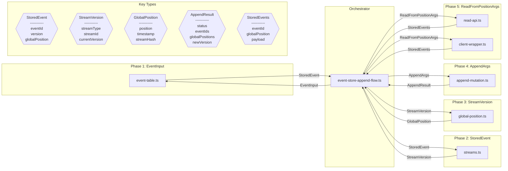

# Design Review: EventStoreFoundation

**Purpose:** Auto-generated design review with sequence and component diagrams
**Detail Level:** Design review artifact from sequence annotations

---

**Pattern:** EventStoreFoundation | **Phase:** Phase 2 | **Status:** completed | **Orchestrator:** event-store-append-flow | **Steps:** 5 | **Participants:** 7

**Source:** `libar-platform/architect/specs/platform/event-store-foundation.feature`

---

## Annotation Convention

This design review is generated from the following annotations:

| Tag                   | Level    | Format | Purpose                            |
| --------------------- | -------- | ------ | ---------------------------------- |
| sequence-orchestrator | Feature  | value  | Identifies the coordinator module  |
| sequence-step         | Rule     | number | Explicit execution ordering        |
| sequence-module       | Rule     | csv    | Maps Rule to deliverable module(s) |
| sequence-error        | Scenario | flag   | Marks scenario as error/alt path   |

Description markers: `**Input:**` and `**Output:**` in Rule descriptions define data flow types for sequence diagram call arrows and component diagram edges.

---

## Sequence Diagram — Runtime Interaction Flow

Generated from: `@architect-sequence-step`, `@architect-sequence-module`, `@architect-sequence-error`, `**Input:**`/`**Output:**` markers, and `@architect-sequence-orchestrator` on the Feature.

```mermaid
sequenceDiagram
    participant User
    participant event_store_append_flow as "event-store-append-flow.ts"
    participant event_table as "event-table.ts"
    participant streams as "streams.ts"
    participant global_position as "global-position.ts"
    participant append_mutation as "append-mutation.ts"
    participant read_api as "read-api.ts"
    participant client_wrapper as "client-wrapper.ts"

    User->>event_store_append_flow: invoke

    Note over event_store_append_flow: Rule 1 — Events are permanently immutable after append — no update or delete operations exist. Once an event is appended to a stream, it cannot be modified or deleted. Events form a permanent audit trail that serves as the source of truth for both CMS state and projection data. This immutability is enforced at the API level - the Event Store provides no update or delete operations for events.

    event_store_append_flow->>+event_table: EventInput
    event_table-->>-event_store_append_flow: StoredEvent

    Note over event_store_append_flow: Rule 2 — Each stream version starts at 1 and increments monotonically per entity. Each stream represents a single entity (aggregate) and maintains its own version sequence starting at 1. Events within a stream are ordered by their version number, ensuring deterministic replay if ever needed. The stream is identified by (streamType, streamId) pair: - streamType: The entity type (e.g., &quot;Order&quot;, &quot;Product&quot;) - streamId: The unique identifier within that type

    event_store_append_flow->>+streams: StoredEvent
    streams-->>-event_store_append_flow: StreamVersion

    Note over event_store_append_flow: Rule 3 — globalPosition is monotonically increasing and globally unique across all streams. While version provides per-stream ordering, globalPosition provides a monotonically increasing counter across ALL events from ALL streams. This is critical for projections that need to process events in causal order. The globalPosition formula ensures: - Globally unique positions (stream identity hash included) - Monotonically increasing within a stream - Time-ordered across streams (timestamp is primary sort key) Formula: timestamp * 1,000,000 + streamHash * 1,000 + (version % 1000)

    event_store_append_flow->>+global_position: StreamVersion
    global_position-->>-event_store_append_flow: GlobalPosition

    Note over event_store_append_flow: Rule 4 — Append succeeds only when expectedVersion matches currentVersion. When appending events, callers must provide an expectedVersion: - If expectedVersion matches the stream's currentVersion, append succeeds - If expectedVersion mismatches, append returns a conflict result - For new streams, expectedVersion = 0 This enables safe concurrent access without locks while ensuring business invariants are validated against consistent state.

    event_store_append_flow->>+append_mutation: AppendArgs
    append_mutation-->>-event_store_append_flow: AppendResult

    Note over event_store_append_flow: Rule 5 — Projections resume from lastProcessedPosition with no missed or duplicated events. Projections track their lastProcessedPosition (a globalPosition value). On restart, projections query events starting from their checkpoint, ensuring no events are missed and no events are processed twice. The readFromPosition API supports this pattern by accepting a starting globalPosition and returning events in order.

    event_store_append_flow->>+read_api: ReadFromPositionArgs
    read_api-->>-event_store_append_flow: StoredEvents
    event_store_append_flow->>+client_wrapper: ReadFromPositionArgs
    client_wrapper-->>-event_store_append_flow: StoredEvents

```

---

## Component Diagram — Types and Data Flow

Generated from: `@architect-sequence-module` (nodes), `**Input:**`/`**Output:**` (edges and type shapes), deliverables table (locations), and `sequence-step` (grouping).



---

## Key Type Definitions

| Type             | Fields                                        | Produced By              | Consumed By     |
| ---------------- | --------------------------------------------- | ------------------------ | --------------- |
| `StoredEvent`    | eventId, version, globalPosition              | event-table              | streams         |
| `StreamVersion`  | streamType, streamId, currentVersion          | streams                  | global-position |
| `GlobalPosition` | position, timestamp, streamHash               | global-position          |                 |
| `AppendResult`   | status, eventIds, globalPositions, newVersion | append-mutation          |                 |
| `StoredEvents`   | eventId, globalPosition, payload              | read-api, client-wrapper |                 |

---

## Design Questions

Verify these design properties against the diagrams above:

| #    | Question                             | Auto-Check                      | Diagram   |
| ---- | ------------------------------------ | ------------------------------- | --------- |
| DQ-1 | Is the execution ordering correct?   | 5 steps in monotonic order      | Sequence  |
| DQ-2 | Are all interfaces well-defined?     | 5 distinct types across 5 steps | Component |
| DQ-3 | Is error handling complete?          | 0 error paths identified        | Sequence  |
| DQ-4 | Is data flow unidirectional?         | Review component diagram edges  | Component |
| DQ-5 | Does validation prove the full path? | Review final step               | Both      |

---

## Findings

Record design observations from reviewing the diagrams above. Each finding should reference which diagram revealed it and its impact on the spec.

| #   | Finding                                     | Diagram Source | Impact on Spec |
| --- | ------------------------------------------- | -------------- | -------------- |
| F-1 | (Review the diagrams and add findings here) | —              | —              |

---

## Summary

The EventStoreFoundation design review covers 5 sequential steps across 7 participants with 5 key data types and 0 error paths.
