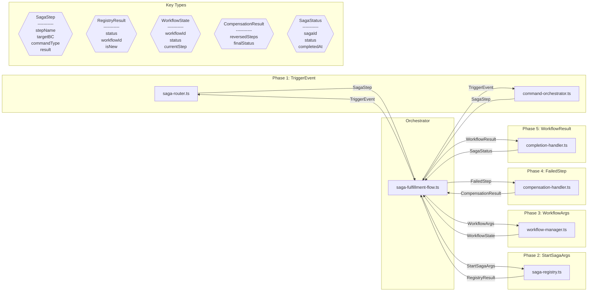

# Design Review: SagaOrchestration

**Purpose:** Auto-generated design review with sequence and component diagrams
**Detail Level:** Design review artifact from sequence annotations

---

**Pattern:** SagaOrchestration | **Phase:** Phase 6 | **Status:** completed | **Orchestrator:** saga-fulfillment-flow | **Steps:** 5 | **Participants:** 7

**Source:** `libar-platform/architect/specs/platform/saga-orchestration.feature`

---

## Annotation Convention

This design review is generated from the following annotations:

| Tag                   | Level    | Format | Purpose                            |
| --------------------- | -------- | ------ | ---------------------------------- |
| sequence-orchestrator | Feature  | value  | Identifies the coordinator module  |
| sequence-step         | Rule     | number | Explicit execution ordering        |
| sequence-module       | Rule     | csv    | Maps Rule to deliverable module(s) |
| sequence-error        | Scenario | flag   | Marks scenario as error/alt path   |

Description markers: `**Input:**` and `**Output:**` in Rule descriptions define data flow types for sequence diagram call arrows and component diagram edges.

---

## Sequence Diagram — Runtime Interaction Flow

Generated from: `@architect-sequence-step`, `@architect-sequence-module`, `@architect-sequence-error`, `**Input:**`/`**Output:**` markers, and `@architect-sequence-orchestrator` on the Feature.

```mermaid
sequenceDiagram
    participant User
    participant saga_fulfillment_flow as "saga-fulfillment-flow.ts"
    participant saga_router as "saga-router.ts"
    participant command_orchestrator as "command-orchestrator.ts"
    participant saga_registry as "saga-registry.ts"
    participant workflow_manager as "workflow-manager.ts"
    participant compensation_handler as "compensation-handler.ts"
    participant completion_handler as "completion-handler.ts"

    User->>saga_fulfillment_flow: invoke

    Note over saga_fulfillment_flow: Rule 1 — Each saga step uses the CommandOrchestrator for dual-write semantics within target BC. When a business process spans multiple bounded contexts (e.g., Orders, Inventory, Shipping), a Saga coordinates the steps: 1. Receive trigger event (e.g., OrderSubmitted) 2. Call Inventory BC to reserve stock 3. On success: Confirm reservation and update order 4. On failure: Execute compensation (cancel order) Each step uses the CommandOrchestrator to maintain dual-write semantics within the target bounded context.

    saga_fulfillment_flow->>+saga_router: TriggerEvent
    saga_router-->>-saga_fulfillment_flow: SagaStep
    saga_fulfillment_flow->>+command_orchestrator: TriggerEvent
    command_orchestrator-->>-saga_fulfillment_flow: SagaStep

    alt Compensation on step failure
        saga_fulfillment_flow-->>User: error
        saga_fulfillment_flow->>saga_fulfillment_flow: exit(1)
    end

    Note over saga_fulfillment_flow: Rule 2 — Same sagaId never starts duplicate workflows — registry returns existing info. Each saga has a unique sagaId (typically the entity ID triggering it). The registry checks for existing sagas before starting: - If saga exists: Return existing saga info, do not start duplicate - If new: Create saga record, start workflow This ensures network retries and event redelivery don't create multiple workflows for the same business operation.

    saga_fulfillment_flow->>+saga_registry: StartSagaArgs
    saga_registry-->>-saga_fulfillment_flow: RegistryResult

    Note over saga_fulfillment_flow: Rule 3 — Workflow state persists automatically — server restarts resume from last completed step. Sagas use Convex Workflow for durable execution: - Workflow state is persisted automatically - Server restarts resume from the last completed step - External events (awaitEvent) allow pausing for external input This durability is critical for long-running processes that may span minutes or hours (e.g., waiting for payment confirmation).

    saga_fulfillment_flow->>+workflow_manager: WorkflowArgs
    workflow_manager-->>-saga_fulfillment_flow: WorkflowState

    Note over saga_fulfillment_flow: Rule 4 — Compensation runs in reverse order of completed steps on failure. If step N fails after steps 1..N-1 succeeded, compensation logic must undo the effects of the completed steps: &#124; Step &#124; Success Action &#124; Compensation &#124; &#124; Reserve inventory &#124; Stock reserved &#124; Release reservation &#124; &#124; Charge payment &#124; Payment captured &#124; Refund payment &#124; &#124; Update order &#124; Order confirmed &#124; Cancel order &#124; Compensation runs in reverse order of the original steps.

    saga_fulfillment_flow->>+compensation_handler: FailedStep
    compensation_handler-->>-saga_fulfillment_flow: CompensationResult

    Note over saga_fulfillment_flow: Rule 5 — Workflow code has no database access — status updates are external via onComplete. The workflow's onComplete handler updates the saga's status in the sagas table. This separation ensures: - Workflow code remains pure (no database access) - Status updates are atomic with workflow completion - Failed status updates can be retried independently Status values: pending -> running -> completed &#124; failed &#124; compensating

    saga_fulfillment_flow->>+completion_handler: WorkflowResult
    completion_handler-->>-saga_fulfillment_flow: SagaStatus

```

---

## Component Diagram — Types and Data Flow

Generated from: `@architect-sequence-module` (nodes), `**Input:**`/`**Output:**` (edges and type shapes), deliverables table (locations), and `sequence-step` (grouping).

---

## Key Type Definitions

| Type                 | Fields                                  | Produced By                       | Consumed By |
| -------------------- | --------------------------------------- | --------------------------------- | ----------- |
| `SagaStep`           | stepName, targetBC, commandType, result | saga-router, command-orchestrator |             |
| `RegistryResult`     | status, workflowId, isNew               | saga-registry                     |             |
| `WorkflowState`      | workflowId, status, currentStep         | workflow-manager                  |             |
| `CompensationResult` | reversedSteps, finalStatus              | compensation-handler              |             |
| `SagaStatus`         | sagaId, status, completedAt             | completion-handler                |             |

---

## Design Questions

Verify these design properties against the diagrams above:

| #    | Question                             | Auto-Check                      | Diagram   |
| ---- | ------------------------------------ | ------------------------------- | --------- |
| DQ-1 | Is the execution ordering correct?   | 5 steps in monotonic order      | Sequence  |
| DQ-2 | Are all interfaces well-defined?     | 5 distinct types across 5 steps | Component |
| DQ-3 | Is error handling complete?          | 1 error paths identified        | Sequence  |
| DQ-4 | Is data flow unidirectional?         | Review component diagram edges  | Component |
| DQ-5 | Does validation prove the full path? | Review final step               | Both      |

---

## Findings

Record design observations from reviewing the diagrams above. Each finding should reference which diagram revealed it and its impact on the spec.

| #   | Finding                                     | Diagram Source | Impact on Spec |
| --- | ------------------------------------------- | -------------- | -------------- |
| F-1 | (Review the diagrams and add findings here) | —              | —              |

---

## Summary

The SagaOrchestration design review covers 5 sequential steps across 7 participants with 5 key data types and 1 error paths.
