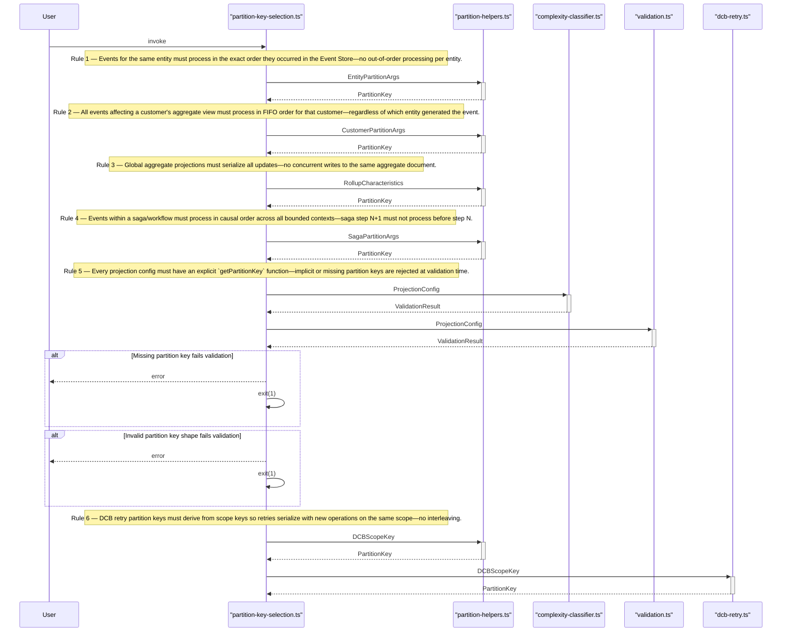
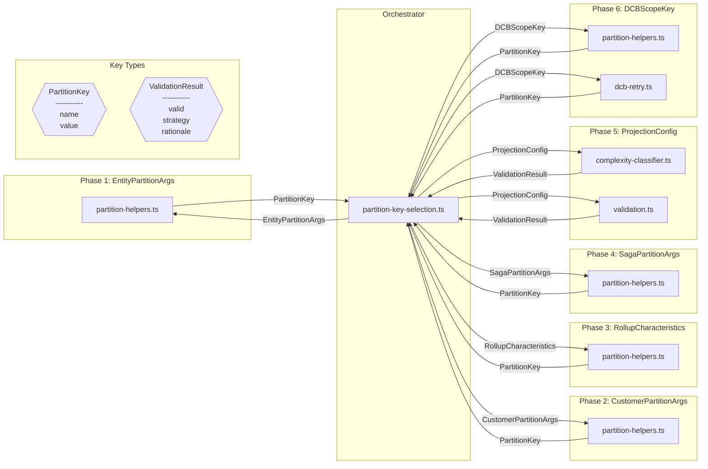

# Design Review: WorkpoolPartitioningStrategy

**Purpose:** Auto-generated design review with sequence and component diagrams
**Detail Level:** Design review artifact from sequence annotations

---

**Pattern:** WorkpoolPartitioningStrategy | **Phase:** Phase 18 | **Status:** completed | **Orchestrator:** partition-key-selection | **Steps:** 6 | **Participants:** 5

**Source:** `libar-platform/architect/specs/platform/workpool-partitioning-strategy.feature`

---

## Annotation Convention

This design review is generated from the following annotations:

| Tag                   | Level    | Format | Purpose                            |
| --------------------- | -------- | ------ | ---------------------------------- |
| sequence-orchestrator | Feature  | value  | Identifies the coordinator module  |
| sequence-step         | Rule     | number | Explicit execution ordering        |
| sequence-module       | Rule     | csv    | Maps Rule to deliverable module(s) |
| sequence-error        | Scenario | flag   | Marks scenario as error/alt path   |

Description markers: `**Input:**` and `**Output:**` in Rule descriptions define data flow types for sequence diagram call arrows and component diagram edges.

---

## Sequence Diagram — Runtime Interaction Flow

Generated from: `@architect-sequence-step`, `@architect-sequence-module`, `@architect-sequence-error`, `**Input:**`/`**Output:**` markers, and `@architect-sequence-orchestrator` on the Feature.

---

## Component Diagram — Types and Data Flow

Generated from: `@architect-sequence-module` (nodes), `**Input:**`/`**Output:**` (edges and type shapes), deliverables table (locations), and `sequence-step` (grouping).

---

## Key Type Definitions

| Type               | Fields                     | Produced By                                                                                              | Consumed By |
| ------------------ | -------------------------- | -------------------------------------------------------------------------------------------------------- | ----------- |
| `PartitionKey`     | name, value                | partition-helpers, partition-helpers, partition-helpers, partition-helpers, partition-helpers, dcb-retry |             |
| `ValidationResult` | valid, strategy, rationale | complexity-classifier, validation                                                                        |             |

---

## Design Questions

Verify these design properties against the diagrams above:

| #    | Question                             | Auto-Check                      | Diagram   |
| ---- | ------------------------------------ | ------------------------------- | --------- |
| DQ-1 | Is the execution ordering correct?   | 6 steps in monotonic order      | Sequence  |
| DQ-2 | Are all interfaces well-defined?     | 2 distinct types across 6 steps | Component |
| DQ-3 | Is error handling complete?          | 2 error paths identified        | Sequence  |
| DQ-4 | Is data flow unidirectional?         | Review component diagram edges  | Component |
| DQ-5 | Does validation prove the full path? | Review final step               | Both      |

---

## Findings

Record design observations from reviewing the diagrams above. Each finding should reference which diagram revealed it and its impact on the spec.

| #   | Finding                                     | Diagram Source | Impact on Spec |
| --- | ------------------------------------------- | -------------- | -------------- |
| F-1 | (Review the diagrams and add findings here) | —              | —              |

---

## Summary

The WorkpoolPartitioningStrategy design review covers 6 sequential steps across 5 participants with 2 key data types and 2 error paths.
