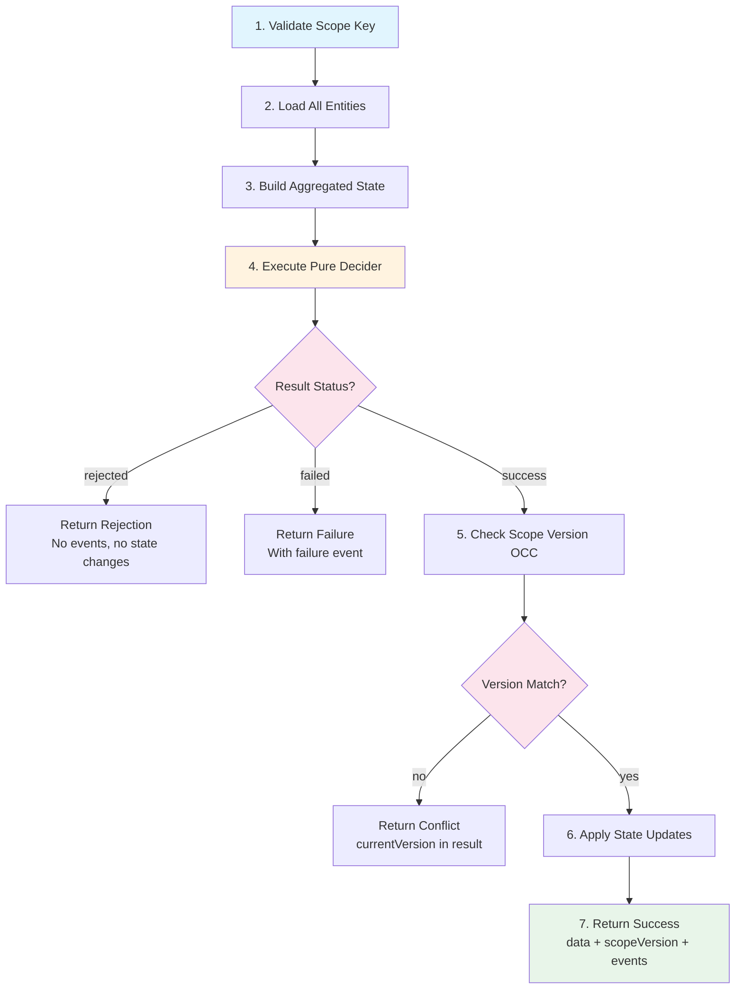

# DCBAPIReference

**Purpose:** Compact reference for Claude context
**Detail Level:** summary

---

## Overview

### Core Types

- `DCBScopeKey` - type
- `ParsedScopeKey` - interface
- `ScopeKeyValidationError` - interface
- `DCBScope` - interface
- `ScopeVersionCheckResult` - type
- `ScopeCommitResult` - type
- `ScopeOperations` - interface
- `DCBEntityState` - interface
- `DCBAggregatedState` - interface
- `DCBStateUpdates` - type
- `DCBDecider` - type
- `DCBEntityConfig` - interface
- `ExecuteWithDCBConfig` - interface
- `DCBExecutionResult` - type
- `DCBSuccessResult` - interface
- `DCBRejectedResult` - interface
- `DCBFailedResult` - interface
- `DCBConflictResult` - interface
- `DCBDeferredResult` - interface
- `DCBRetryResult` - type

### Scope Key Utilities

- `SCOPE_KEY_PREFIX` - const
- `createScopeKey` - function
- `tryCreateScopeKey` - function
- `parseScopeKey` - function
- `validateScopeKey` - function
- `isValidScopeKey` - function
- `assertValidScopeKey` - function
- `isScopeTenant` - function
- `extractTenantId` - function
- `extractScopeType` - function
- `extractScopeId` - function

### executeWithDCB Flow

```typescript
import { executeWithDCB, createScopeKey } from "@libar-dev/platform-core/dcb";

const result = await executeWithDCB(ctx, {
  scopeKey: createScopeKey("tenant_1", "reservation", "res_123"),
  expectedVersion: 0,
  boundedContext: "inventory",
  streamType: "Reservation",
  schemaVersion: 1,
  entities: {
    streamIds: ["product-1", "product-2"],
    loadEntity: async (ctx, streamId) => {
      const product = await inventoryRepo.tryLoad(ctx, streamId);
      return product ? { cms: product, _id: product._id } : null;
    },
  },
  decider: reserveMultipleDecider,
  command: { orderId: "order_456", items },
  applyUpdate: async (ctx, _id, cms, update, version, timestamp) => {
    await ctx.db.patch(_id, { ...update, version, updatedAt: timestamp });
  },
  commandId: "cmd_789",
  correlationId: "corr_abc",
});

switch (result.status) {
  case "success":
    // Append result.events to Event Store
    break;
  case "rejected":
    // Business rule violation - result.code, result.reason
    break;
  case "conflict":
    // OCC conflict - retry with fresh state
    break;
}
```


