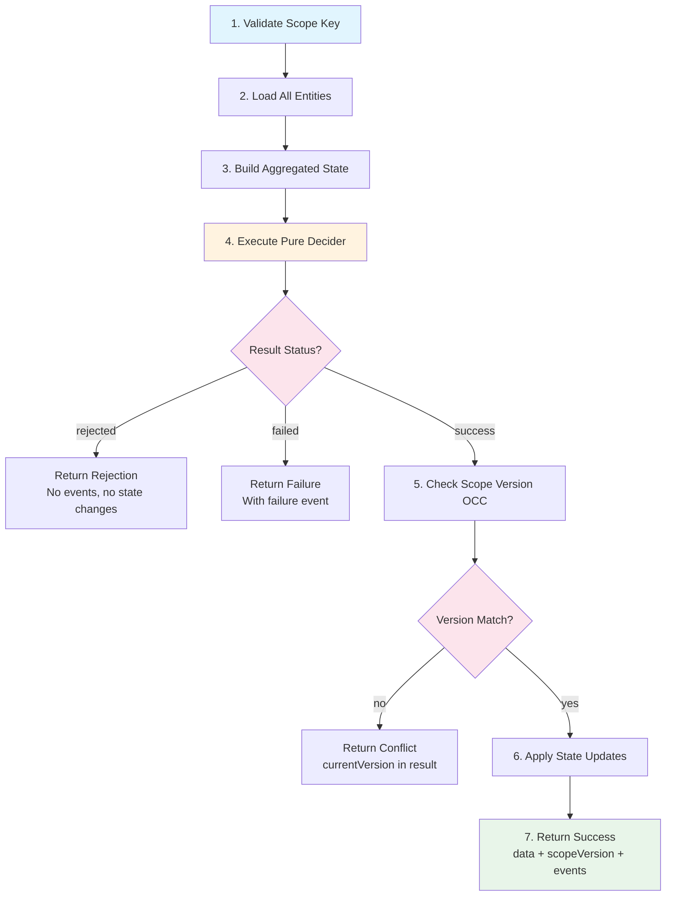

# DCBAPIReference

**Purpose:** Full documentation generated from decision document
**Detail Level:** detailed

---

This feature file demonstrates code-first documentation generation.
  The API reference is extracted directly from annotated TypeScript source files,
  proving that documentation can be a projection of code.

  **Key Insight:** DCB enables cross-entity invariant validation within a single
  bounded context with scope-based OCC.

---

## Context

### Why DCB Exists

**Problem:** Traditional approaches to multi-entity coordination have significant
    drawbacks:
    - **Saga coordination** provides only eventual consistency
    - **Sequential commands** create race condition windows
    - **Aggregate enlargement** violates single responsibility

    **Solution:** DCB provides atomic validation across multiple entities with
    scope-based optimistic concurrency control (OCC), all within a single
    bounded context.

## Decision

### Scope-Based OCC

DCB uses a scope key to coordinate multiple entities atomically.

    **Scope Key Format:** `tenant:${tenantId}:${scopeType}:${scopeId}`

    The tenant prefix is mandatory to ensure multi-tenant isolation at the scope level.

### executeWithDCB Flow

The following diagram shows the step-by-step flow of the `executeWithDCB` function:

    """mermaid
    flowchart TD
        A[1. Validate Scope Key] --> B[2. Load All Entities]
        B --> C[3. Build Aggregated State]
        C --> D[4. Execute Pure Decider]
        D --> E{Result Status?}
        E -->|rejected| F[Return Rejection<br/>No events, no state changes]
        E -->|failed| G[Return Failure<br/>With failure event]
        E -->|success| H[5. Check Scope Version OCC]
        H --> I{Version Match?}
        I -->|no| J[Return Conflict<br/>currentVersion in result]
        I -->|yes| K[6. Apply State Updates]
        K --> L[7. Return Success<br/>data + scopeVersion + events]

        style A fill:#e1f5fe
        style D fill:#fff3e0
        style E fill:#fce4ec
        style I fill:#fce4ec
        style L fill:#e8f5e9
    """

    **Step Details:**

    1. **Validate Scope Key** - Ensures tenant prefix is present for isolation
    2. **Load All Entities** - Calls `loadEntity()` for each streamId in config
    3. **Build Aggregated State** - Creates `DCBAggregatedState` with all entities
    4. **Execute Pure Decider** - Calls decider function with aggregated state
    5. **Check Scope Version** - OCC validation via `scopeOperations.commitScope()`
    6. **Apply State Updates** - Calls `applyUpdate()` for each entity with changes
    7. **Return Success** - Returns data, new scopeVersion, and events to append

## Implementation Details

### Core Types

```typescript
/**
 * Branded type for DCB scope keys.
 *
 * Format: `tenant:${tenantId}:${scopeType}:${scopeId}`
 *
 * The brand ensures type safety - you can't accidentally pass a regular
 * string where a validated scope key is expected.
 *
 * @example
 * ```typescript
 * const scopeKey = createScopeKey("t1", "reservation", "res_123");
 * // Type: DCBScopeKey (branded string)
 * ```
 */
type DCBScopeKey = string & { readonly __brand: "DCBScopeKey" };
```

```typescript
/**
 * Parsed components of a scope key.
 */
interface ParsedScopeKey {
  /** Tenant ID for isolation */
  tenantId: string;
  /** Type of scope (e.g., "reservation", "order") */
  scopeType: string;
  /** Unique ID within the scope type */
  scopeId: string;
  /** Original scope key */
  raw: DCBScopeKey;
}
```

```typescript
/**
 * Validation error for scope keys.
 */
interface ScopeKeyValidationError {
  code: "INVALID_SCOPE_KEY_FORMAT" | "TENANT_ID_REQUIRED" | "SCOPE_KEY_EMPTY";
  message: string;
}
```

```typescript
/**
 * DCB scope metadata as stored in dcbScopes table.
 */
interface DCBScope {
  /** Unique scope key */
  scopeKey: DCBScopeKey;
  /** Current version for OCC */
  currentVersion: number;
  /** Tenant ID for isolation */
  tenantId: string;
  /** Type of scope */
  scopeType: string;
  /** Unique ID within scope type */
  scopeId: string;
  /** Creation timestamp */
  createdAt: number;
  /** Last update timestamp */
  lastUpdatedAt: number;
  /** Stream IDs participating in this scope (for virtual streams) */
  streamIds?: string[];
}
```

```typescript
/**
 * Result types for scope operations.
 */
type ScopeVersionCheckResult =
  | { status: "match" }
  | { status: "mismatch"; currentVersion: number }
  | { status: "not_found" };
```

```typescript
type ScopeCommitResult =
  | { status: "success"; newVersion: number }
  | { status: "conflict"; currentVersion: number };
```

```typescript
/**
 * Scope operations interface for DCB execution.
 *
 * These operations are provided by the caller (typically wrapping platform-store
 * component functions) to enable scope-level OCC within the mutation.
 *
 * ## Why callbacks instead of direct calls?
 *
 * Convex components have isolated databases. The DCB execution logic in
 * platform-core cannot directly access platform-store tables. Instead, the
 * caller passes callbacks that wrap component API calls.
 *
 * ## Transaction Safety
 *
 * All operations run within the same Convex mutation, ensuring atomicity:
 * - `getScope` reads touch the scope record for Convex's internal OCC
 * - `commitScope` validates version before committing
 * - If conflict detected, caller should not persist entity changes
 *
 * @example
 * ```typescript
 * const scopeOperations: ScopeOperations = {
 *   getScope: async () => {
 *     const result = await ctx.runQuery(components.eventStore.lib.getScope, {
 *       scopeKey: config.scopeKey,
 *     });
 *     return result;
 *   },
 *   commitScope: async (streamIds) => {
 *     return ctx.runMutation(components.eventStore.lib.commitScope, {
 *       scopeKey: config.scopeKey,
 *       expectedVersion: config.expectedVersion,
 *       streamIds,
 *     });
 *   },
 * };
 * ```
 */
interface ScopeOperations {
  /**
   * Get current scope state.
   *
   * Returns scope data if exists, null if scope doesn't exist.
   * For new scopes (expectedVersion = 0), this may return null.
   */
  getScope: () => Promise<{
    currentVersion: number;
    tenantId: string;
    scopeType: string;
    scopeId: string;
  } | null>;

  /**
   * Atomically commit scope version increment with OCC validation.
   *
   * This function:
   * 1. Validates expectedVersion matches current version
   * 2. Increments version if match
   * 3. Updates streamIds list for virtual stream queries
   * 4. Returns success with new version, or conflict with current version
   *
   * @param streamIds - Stream IDs to associate with this scope
   * @returns Commit result with new version or conflict info
   */
  commitScope: (streamIds: string[]) => Promise<ScopeCommitResult>;
}
```

```typescript
/**
 * Entity state within a DCB scope.
 *
 * Represents one entity (CMS document) participating in a scope operation.
 */
interface DCBEntityState<TCms, TId = unknown> {
  /** Stream ID of this entity */
  streamId: string;
  /** Current CMS state */
  cms: TCms;
  /** Document ID for updates */
  _id: TId;
}
```

```typescript
/**
 * Aggregated state for DCB decider.
 *
 * Contains all entity states within the scope, enabling cross-entity
 * invariant validation in the pure decider function.
 */
interface DCBAggregatedState<TCms> {
  /** Scope key for this operation */
  scopeKey: DCBScopeKey;
  /** Current scope version (for OCC) */
  scopeVersion: number;
  /** Map of streamId → entity state */
  entities: Map<string, DCBEntityState<TCms>>;
}
```

```typescript
/**
 * State updates returned by DCB decider.
 *
 * Maps streamId to the update for that entity. Only entities with updates
 * in this map will be modified.
 */
type DCBStateUpdates<TUpdate> = Map<string, TUpdate>;
```

```typescript
/**
 * DCB decider function signature.
 *
 * Unlike regular deciders that operate on a single entity, DCB deciders
 * receive aggregated state from all entities in the scope, enabling
 * cross-entity invariant validation.
 *
 * @typeParam TCms - CMS state type for entities in scope
 * @typeParam TCommand - Command input type
 * @typeParam TEvent - Event type for success/failure
 * @typeParam TData - Success data type
 * @typeParam TStateUpdate - State update type for individual entities
 */
type DCBDecider<
  TCms,
  TCommand extends object,
  TEvent extends DeciderEvent,
  TData extends object,
  TStateUpdate,
> = (
  state: DCBAggregatedState<TCms>,
  command: TCommand,
  context: DeciderContext
) => DeciderOutput<TEvent, TData, DCBStateUpdates<TStateUpdate>>;
```

```typescript
/**
 * Configuration for loading entities in a DCB operation.
 */
interface DCBEntityConfig<TCtx, TCms, TId = unknown> {
  /** Stream IDs of entities to load */
  streamIds: string[];

  /**
   * Load function for each entity.
   *
   * @param ctx - Mutation context
   * @param streamId - Stream ID to load
   * @returns Entity state if found, null if not exists
   */
  loadEntity: (
    ctx: TCtx,
    streamId: string
  ) => Promise<{
    cms: TCms;
    _id: TId;
  } | null>;
}
```

```typescript
/**
 * Configuration for executeWithDCB.
 *
 * @typeParam TCtx - Convex mutation context type
 * @typeParam TCms - CMS state type
 * @typeParam TCommand - Command input type
 * @typeParam TEvent - Event type
 * @typeParam TData - Success data type
 * @typeParam TStateUpdate - State update type
 * @typeParam TId - Document ID type
 */
interface ExecuteWithDCBConfig<
  TCtx,
  TCms,
  TCommand extends object,
  TEvent extends DeciderEvent,
  TData extends object,
  TStateUpdate,
  TId = unknown,
> {
  /** Scope key for coordination */
  scopeKey: DCBScopeKey;

  /** Expected scope version for OCC (0 for new scopes) */
  expectedVersion: number;

  /** Bounded context name */
  boundedContext: string;

  /** Stream type for events */
  streamType: string;

  /** Event schema version */
  schemaVersion: number;

  /**
   * Event category for taxonomy classification.
   *
   * Defaults to "domain" if not specified.
   * - domain: Internal facts within bounded context for ES replay
   * - integration: Cross-context communication with versioned contracts
   * - trigger: ID-only notifications for GDPR compliance
   * - fat: Full state snapshots for external systems
   */
  eventCategory?: EventCategory;

  /**
   * Scope operations for OCC (Optimistic Concurrency Control).
   *
   * These callbacks wrap platform-store component functions to enable
   * scope-level version checking and committing within the mutation.
   *
   * **Required for OCC enforcement.** If not provided, scope version
   * checking is skipped (useful for testing pure decider logic).
   */
  scopeOperations?: ScopeOperations;

  /** Entity loading configuration */
  entities: DCBEntityConfig<TCtx, TCms, TId>;

  /** Pure decider function */
  decider: DCBDecider<TCms, TCommand, TEvent, TData, TStateUpdate>;

  /** Command to execute */
  command: TCommand;

  /**
   * Apply state update to individual entity.
   *
   * Called for each entity with an update in the decider's stateUpdate map.
   */
  applyUpdate: (
    ctx: TCtx,
    _id: TId,
    cms: TCms,
    update: TStateUpdate,
    version: number,
    timestamp: number
  ) => Promise<void>;

  /** Command ID for correlation */
  commandId: string;

  /** Correlation ID for tracing */
  correlationId: string;

  /** Optional logger */
  logger?: Logger;
}
```

```typescript
/**
 * Result from executeWithDCB.
 */
type DCBExecutionResult<TData extends object> =
  | DCBSuccessResult<TData>
  | DCBRejectedResult
  | DCBFailedResult
  | DCBConflictResult;
```

```typescript
/**
 * Successful DCB execution result.
 */
interface DCBSuccessResult<TData extends object> {
  status: "success";
  /** Data returned from decider */
  data: TData;
  /** New scope version after commit */
  scopeVersion: number;
  /** Events to append to Event Store */
  events: EventData[];
}
```

```typescript
/**
 * Rejected DCB execution (business rule violation, no events emitted).
 */
interface DCBRejectedResult {
  status: "rejected";
  /** Error code */
  code: string;
  /** Human-readable reason */
  reason: string;
  /** Optional context */
  context?: UnknownRecord;
}
```

```typescript
/**
 * Failed DCB execution (business failure with event).
 */
interface DCBFailedResult {
  status: "failed";
  /** Failure reason */
  reason: string;
  /** Events to append (failure events) */
  events: EventData[];
  /** Optional context */
  context?: UnknownRecord;
}
```

```typescript
/**
 * OCC conflict detected during DCB execution.
 */
interface DCBConflictResult {
  status: "conflict";
  /** Current scope version (different from expected) */
  currentVersion: number;
}
```

```typescript
/**
 * Deferred DCB execution (retry scheduled via Workpool).
 *
 * Returned when an OCC conflict is detected and a retry has been
 * scheduled. The operation will be retried automatically with the
 * updated expectedVersion.
 *
 * @since Phase 18a
 */
interface DCBDeferredResult {
  status: "deferred";
  /** Workpool job ID for tracking the scheduled retry */
  workId: string;
  /** Which retry attempt was scheduled (0-indexed) */
  retryAttempt: number;
  /** Delay in milliseconds before retry executes */
  scheduledAfterMs: number;
}
```

```typescript
/**
 * Result type including deferred status for DCB retry operations.
 *
 * This extends DCBExecutionResult to include the "deferred" status
 * returned when a conflict triggers an automatic retry via Workpool.
 *
 * @typeParam TData - Success data type from decider
 * @since Phase 18a
 */
type DCBRetryResult<TData extends object> =
  | DCBSuccessResult<TData>
  | DCBRejectedResult
  | DCBFailedResult
  | DCBDeferredResult;
```

### Scope Key Utilities

```typescript
/**
 * Scope key prefix for tenant isolation.
 */
SCOPE_KEY_PREFIX = "tenant:" as const
```

```typescript
/**
 * Create a scope key from components.
 *
 * @param tenantId - Tenant ID for isolation
 * @param scopeType - Type of scope (e.g., "reservation", "order")
 * @param scopeId - Unique ID within the scope type
 * @returns Branded scope key
 * @throws Error if any component is empty or contains invalid characters
 *
 * @example
 * ```typescript
 * const scopeKey = createScopeKey("tenant_123", "reservation", "res_456");
 * // Returns: "tenant:tenant_123:reservation:res_456" as DCBScopeKey
 * ```
 */
function createScopeKey(tenantId: string, scopeType: string, scopeId: string): DCBScopeKey;
```

```typescript
/**
 * Create a scope key from components, returning null on invalid input.
 *
 * Safe version of createScopeKey that doesn't throw.
 *
 * @param tenantId - Tenant ID for isolation
 * @param scopeType - Type of scope
 * @param scopeId - Unique ID within the scope type
 * @returns Branded scope key or null if invalid
 */
function tryCreateScopeKey(
  tenantId: string,
  scopeType: string,
  scopeId: string
): DCBScopeKey | null;
```

```typescript
/**
 * Parse a scope key into its components.
 *
 * @param scopeKey - Scope key to parse
 * @returns Parsed components if valid, null if invalid format
 *
 * @example
 * ```typescript
 * const parsed = parseScopeKey("tenant:t1:order:o1");
 * // Returns: { tenantId: "t1", scopeType: "order", scopeId: "o1", raw: "..." }
 *
 * const invalid = parseScopeKey("invalid");
 * // Returns: null
 * ```
 */
function parseScopeKey(scopeKey: string): ParsedScopeKey | null;
```

```typescript
/**
 * Validate a scope key format.
 *
 * @param scopeKey - Scope key to validate
 * @returns Error object if invalid, null if valid
 *
 * @example
 * ```typescript
 * const error = validateScopeKey("reservation:res_123");
 * // Returns: { code: "INVALID_SCOPE_KEY_FORMAT", message: "..." }
 *
 * const valid = validateScopeKey("tenant:t1:reservation:res_123");
 * // Returns: null (valid)
 * ```
 */
function validateScopeKey(scopeKey: string): ScopeKeyValidationError | null;
```

```typescript
/**
 * Check if a scope key is valid.
 *
 * @param scopeKey - Scope key to check
 * @returns true if valid
 */
function isValidScopeKey(scopeKey: string): scopeKey is DCBScopeKey;
```

```typescript
/**
 * Assert that a scope key is valid, throwing if not.
 *
 * @param scopeKey - Scope key to assert
 * @throws Error if scope key is invalid
 */
function assertValidScopeKey(scopeKey: string): asserts scopeKey is DCBScopeKey;
```

```typescript
/**
 * Check if a scope key belongs to a specific tenant.
 *
 * @param scopeKey - Scope key to check
 * @param tenantId - Tenant ID to match
 * @returns true if scope belongs to tenant
 */
function isScopeTenant(scopeKey: DCBScopeKey, tenantId: string): boolean;
```

```typescript
/**
 * Extract tenant ID from scope key.
 *
 * @param scopeKey - Scope key to extract from
 * @returns Tenant ID
 * @throws Error if scope key is invalid
 */
function extractTenantId(scopeKey: DCBScopeKey): string;
```

```typescript
/**
 * Extract scope type from scope key.
 *
 * @param scopeKey - Scope key to extract from
 * @returns Scope type
 * @throws Error if scope key is invalid
 */
function extractScopeType(scopeKey: DCBScopeKey): string;
```

```typescript
/**
 * Extract scope ID from scope key.
 *
 * @param scopeKey - Scope key to extract from
 * @returns Scope ID
 * @throws Error if scope key is invalid
 */
function extractScopeId(scopeKey: DCBScopeKey): string;
```

### executeWithDCB Flow

```typescript
import { executeWithDCB, createScopeKey } from "@libar-dev/platform-core/dcb";

    const result = await executeWithDCB(ctx, {
      scopeKey: createScopeKey("tenant_1", "reservation", "res_123"),
      expectedVersion: 0,
      boundedContext: "inventory",
      streamType: "Reservation",
      schemaVersion: 1,
      entities: {
        streamIds: ["product-1", "product-2"],
        loadEntity: async (ctx, streamId) => {
          const product = await inventoryRepo.tryLoad(ctx, streamId);
          return product ? { cms: product, _id: product._id } : null;
        },
      },
      decider: reserveMultipleDecider,
      command: { orderId: "order_456", items },
      applyUpdate: async (ctx, _id, cms, update, version, timestamp) => {
        await ctx.db.patch(_id, { ...update, version, updatedAt: timestamp });
      },
      commandId: "cmd_789",
      correlationId: "corr_abc",
    });

    switch (result.status) {
      case "success":
        // Append result.events to Event Store
        break;
      case "rejected":
        // Business rule violation - result.code, result.reason
        break;
      case "conflict":
        // OCC conflict - retry with fresh state
        break;
    }
```



### Constraints

This feature file demonstrates code-first documentation generation.
  The API reference is extracted directly from annotated TypeScript source files,
  proving that documentation can be a projection of code.

  **Key Insight:** DCB enables cross-entity invariant validation within a single
  bounded context with scope-based OCC.

## Consequences

### When to Use DCB vs Alternatives

| Criterion | DCB | Saga | Regular Decider |
| --- | --- | --- | --- |
| Scope | Single BC | Cross-BC | Single entity |
| Consistency | Atomic | Eventual | Atomic |
| Use Case | Multi-product reservation | Order fulfillment | Simple updates |

### Constraints and Error Codes

**Mandatory Constraints:**

| Constraint | Enforcement | Error Code |
| --- | --- | --- |
| Single bounded context only | Runtime validation | CROSS_BC_NOT_ALLOWED |
| Tenant-aware scope key | Scope key format | TENANT_ID_REQUIRED |
| Non-empty scope components | Scope key validation | SCOPE_KEY_EMPTY |
| Valid scope key format | Regex validation | INVALID_SCOPE_KEY_FORMAT |
| Decider must be pure | Design pattern | N/A (enforced by types) |

    **Scope Key Validation:**
    - The `tenant:` prefix is mandatory in all scope keys
    - Empty `tenantId`, `scopeType`, or `scopeId` are rejected
    - Colons are not allowed in `tenantId` or `scopeType` (but allowed in `scopeId`)

### Guarantees

**System Guarantees:**

| Guarantee | How Enforced |
| --- | --- |
| Tenant isolation | Scope key must include tenant prefix; validated at creation |
| Atomicity | All state updates + scope commit in same Convex mutation |
| OCC protection | Scope version checked before commit; conflict returns currentVersion |
| No partial updates | Rejected/failed status means no CMS changes persisted |
| Decider purity | Type system enforces no ctx/I/O in decider function signature |
| Event immutability | Events returned for caller to append; not modified by DCB |

    **Conflict Resolution:**
    When an OCC conflict occurs (`status: "conflict"`), the caller should:
    1. Reload the current scope version from the result
    2. Re-fetch entity state
    3. Retry the operation with updated `expectedVersion`

    The `withDCBRetry` helper automates this pattern via Workpool scheduling.

## Source Mapping - Content Extraction Configuration

The following table defines which content is extracted from which source files:

| Section | Source File | Extraction Method |
| --- | --- | --- |
| Core Types | packages/platform-core/src/dcb/types.ts | @extract-shapes tag |
| Scope Key Utilities | packages/platform-core/src/dcb/scopeKey.ts | @extract-shapes tag |
| executeWithDCB Flow | THIS DECISION | Fenced code block (Mermaid) |
| Usage Example | THIS DECISION | Fenced code block |
| Constraints | THIS DECISION | Rule block table |
| Guarantees | THIS DECISION | Rule block table |

    **Usage Example:**

    """typescript
    import { executeWithDCB, createScopeKey } from "@libar-dev/platform-core/dcb";

    const result = await executeWithDCB(ctx, {
      scopeKey: createScopeKey("tenant_1", "reservation", "res_123"),
      expectedVersion: 0,
      boundedContext: "inventory",
      streamType: "Reservation",
      schemaVersion: 1,
      entities: {
        streamIds: ["product-1", "product-2"],
        loadEntity: async (ctx, streamId) => {
          const product = await inventoryRepo.tryLoad(ctx, streamId);
          return product ? { cms: product, _id: product._id } : null;
        },
      },
      decider: reserveMultipleDecider,
      command: { orderId: "order_456", items },
      applyUpdate: async (ctx, _id, cms, update, version, timestamp) => {
        await ctx.db.patch(_id, { ...update, version, updatedAt: timestamp });
      },
      commandId: "cmd_789",
      correlationId: "corr_abc",
    });

    switch (result.status) {
      case "success":
        // Append result.events to Event Store
        break;
      case "rejected":
        // Business rule violation - result.code, result.reason
        break;
      case "conflict":
        // OCC conflict - retry with fresh state
        break;
    }
    """
