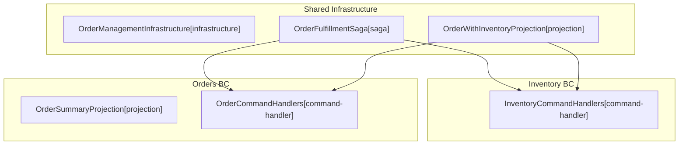

# Architecture

**Purpose:** Auto-generated architecture diagram from source annotations
**Detail Level:** Component diagram with bounded context subgraphs

---

## Overview

This diagram was auto-generated from 6 annotated source files across 2 bounded contexts.

| Metric           | Count |
| ---------------- | ----- |
| Total Components | 6     |
| Bounded Contexts | 2     |
| Component Roles  | 4     |

---

## System Overview

Component architecture with bounded context isolation:

---

## Legend

| Arrow Style | Relationship | Description                              |
| ----------- | ------------ | ---------------------------------------- |
| `-->`       | uses         | Direct dependency (solid arrow)          |
| `-.->`      | depends-on   | Weak dependency (dashed arrow)           |
| `..->`      | implements   | Realization relationship (dotted arrow)  |
| `-->>`      | extends      | Generalization relationship (open arrow) |

---

## Component Inventory

All components with architecture annotations:

| Component                          | Context   | Role            | Layer          | Source File                                                                                    |
| ---------------------------------- | --------- | --------------- | -------------- | ---------------------------------------------------------------------------------------------- |
| ✅ Inventory Command Handlers      | inventory | command-handler | application    | libar-platform/examples/order-management/convex/contexts/inventory/handlers/commands.ts        |
| ✅ Order Command Handlers          | orders    | command-handler | application    | libar-platform/examples/order-management/convex/contexts/orders/handlers/commands.ts           |
| ✅ Order Summary Projection        | orders    | projection      | application    | libar-platform/examples/order-management/convex/projections/orders/orderSummary.ts             |
| ✅ Order Management Infrastructure | -         | infrastructure  | infrastructure | libar-platform/examples/order-management/convex/infrastructure.ts                              |
| ✅ Order With Inventory Projection | -         | projection      | application    | libar-platform/examples/order-management/convex/projections/crossContext/orderWithInventory.ts |
| ✅ Order Fulfillment Saga          | -         | saga            | application    | libar-platform/examples/order-management/convex/sagas/orderFulfillment.ts                      |
