# Architecture

**Purpose:** Auto-generated architecture diagram from source annotations
**Detail Level:** Component diagram with bounded context subgraphs

---

## Overview

This diagram was auto-generated from 41 annotated source files across 3 bounded contexts.

| Metric           | Count |
| ---------------- | ----- |
| Total Components | 41    |
| Bounded Contexts | 3     |
| Component Roles  | 8     |

---

## System Overview

Component architecture with bounded context isolation:

```mermaid
graph TB
    subgraph agent["Agent BC"]
        AgentOnCompleteHandler["AgentOnCompleteHandler[infrastructure]"]
        ChurnRiskEventHandler["ChurnRiskEventHandler[command-handler]"]
    end
    subgraph inventory["Inventory BC"]
        InventoryInternalMutations["InventoryInternalMutations[infrastructure]"]
        InventoryPublicAPI["InventoryPublicAPI[infrastructure]"]
        ProductCatalogProjection["ProductCatalogProjection[projection]"]
        ActiveReservationsProjection["ActiveReservationsProjection[projection]"]
        InventoryCommandConfigs["InventoryCommandConfigs[infrastructure]"]
        InventoryCommandHandlers["InventoryCommandHandlers[command-handler]"]
        InventoryDomainEvents["InventoryDomainEvents[bounded-context]"]
        InventoryDeciders["InventoryDeciders[decider]"]
    end
    subgraph orders["Orders BC"]
        OrderPublicAPI["OrderPublicAPI[infrastructure]"]
        ReservationReleasePM["ReservationReleasePM[process-manager]"]
        OrderNotificationPM["OrderNotificationPM[process-manager]"]
        CustomerCancellationsProjection["CustomerCancellationsProjection[projection]"]
        OrderSummaryProjection["OrderSummaryProjection[projection]"]
        OrderItemsProjection["OrderItemsProjection[projection]"]
        OrderCommandConfigs["OrderCommandConfigs[infrastructure]"]
        OrderCommandHandlers["OrderCommandHandlers[command-handler]"]
        OrderDomainEvents["OrderDomainEvents[bounded-context]"]
        OrderDeciders["OrderDeciders[decider]"]
    end
    subgraph shared["Shared Infrastructure"]
        RateLimitDefinitions["RateLimitDefinitions[infrastructure]"]
        OrderManagementInfrastructure["OrderManagementInfrastructure[infrastructure]"]
        EventSubscriptionRegistry["EventSubscriptionRegistry[infrastructure]"]
        CrossContextReadModel["CrossContextReadModel[read-model]"]
        AppCompositionRoot["AppCompositionRoot[infrastructure]"]
        SagaRouter["SagaRouter[infrastructure]"]
        SagaRegistry["SagaRegistry[infrastructure]"]
        OrderFulfillmentSaga["OrderFulfillmentSaga[saga]"]
        SagaCompletionHandler["SagaCompletionHandler[infrastructure]"]
        DurableAppendAction["DurableAppendAction[infrastructure]"]
        ProjectionDefinitions["ProjectionDefinitions[infrastructure]"]
        ProjectionDeadLetters["ProjectionDeadLetters[infrastructure]"]
        IntegrationRoutes["IntegrationRoutes[infrastructure]"]
        IntegrationEventHandlers["IntegrationEventHandlers[infrastructure]"]
        IntegrationEventSchemas["IntegrationEventSchemas[infrastructure]"]
        IntegrationDeadLetters["IntegrationDeadLetters[infrastructure]"]
        DCBRetryExecution["DCBRetryExecution[infrastructure]"]
        CommandRegistry["CommandRegistry[infrastructure]"]
        PaymentOutboxHandler["PaymentOutboxHandler[infrastructure]"]
        MockPaymentActions["MockPaymentActions[infrastructure]"]
        OrderWithInventoryProjection["OrderWithInventoryProjection[projection]"]
    end
    EventSubscriptionRegistry --> OrderNotificationPM
    EventSubscriptionRegistry --> ReservationReleasePM
    SagaRouter --> OrderFulfillmentSaga
    OrderFulfillmentSaga --> OrderCommandHandlers
    OrderFulfillmentSaga --> InventoryCommandHandlers
    SagaCompletionHandler --> SagaRegistry
    ReservationReleasePM --> InventoryCommandHandlers
    ReservationReleasePM --> OrderWithInventoryProjection
    OrderNotificationPM --> OrderCommandHandlers
    IntegrationRoutes --> OrderCommandHandlers
    CommandRegistry --> OrderCommandHandlers
    CommandRegistry --> InventoryCommandHandlers
    ProductCatalogProjection --> InventoryCommandHandlers
    ActiveReservationsProjection --> InventoryCommandHandlers
    CustomerCancellationsProjection --> OrderCommandHandlers
    OrderItemsProjection --> OrderCommandHandlers
    OrderWithInventoryProjection --> OrderCommandHandlers
    OrderWithInventoryProjection --> InventoryCommandHandlers
    InventoryCommandConfigs --> ActiveReservationsProjection
    InventoryCommandConfigs --> ProductCatalogProjection
    InventoryCommandConfigs --> OrderWithInventoryProjection
    OrderCommandConfigs --> OrderSummaryProjection
    OrderCommandConfigs --> OrderWithInventoryProjection
    OrderCommandConfigs --> OrderItemsProjection
    OrderCommandConfigs --> CustomerCancellationsProjection
    OrderCommandHandlers --> OrderDeciders
    ChurnRiskEventHandler --> CustomerCancellationsProjection
    InventoryCommandHandlers --> InventoryDeciders
```

---

## Legend

| Arrow Style | Relationship | Description                              |
| ----------- | ------------ | ---------------------------------------- |
| `-->`       | uses         | Direct dependency (solid arrow)          |
| `-.->`      | depends-on   | Weak dependency (dashed arrow)           |
| `..->`      | implements   | Realization relationship (dotted arrow)  |
| `-->>`      | extends      | Generalization relationship (open arrow) |

---

## Component Inventory

All components with architecture annotations:

| Component                            | Context   | Role            | Layer          | Source File                                                                                    |
| ------------------------------------ | --------- | --------------- | -------------- | ---------------------------------------------------------------------------------------------- |
| ✅ Churn Risk Event Handler          | agent     | command-handler | application    | libar-platform/examples/order-management/convex/contexts/agent/handlers/eventHandler.ts        |
| ✅ Agent On Complete Handler         | agent     | infrastructure  | infrastructure | libar-platform/examples/order-management/convex/contexts/agent/handlers/onComplete.ts          |
| ✅ Inventory Domain Events           | inventory | bounded-context | domain         | libar-platform/examples/order-management/convex/contexts/inventory/domain/events.ts            |
| ✅ Inventory Command Handlers        | inventory | command-handler | application    | libar-platform/examples/order-management/convex/contexts/inventory/handlers/commands.ts        |
| ✅ Inventory Deciders                | inventory | decider         | domain         | libar-platform/examples/order-management/convex/contexts/inventory/domain/deciders/index.ts    |
| ✅ Inventory Command Configs         | inventory | infrastructure  | application    | libar-platform/examples/order-management/convex/commands/inventory/configs.ts                  |
| ✅ Inventory Internal Mutations      | inventory | infrastructure  | infrastructure | libar-platform/examples/order-management/convex/inventoryInternal.ts                           |
| ✅ Inventory Public API              | inventory | infrastructure  | infrastructure | libar-platform/examples/order-management/convex/inventory.ts                                   |
| ✅ Active Reservations Projection    | inventory | projection      | application    | libar-platform/examples/order-management/convex/projections/inventory/activeReservations.ts    |
| ✅ Product Catalog Projection        | inventory | projection      | application    | libar-platform/examples/order-management/convex/projections/inventory/productCatalog.ts        |
| ✅ Order Domain Events               | orders    | bounded-context | domain         | libar-platform/examples/order-management/convex/contexts/orders/domain/events.ts               |
| ✅ Order Command Handlers            | orders    | command-handler | application    | libar-platform/examples/order-management/convex/contexts/orders/handlers/commands.ts           |
| ✅ Order Deciders                    | orders    | decider         | domain         | libar-platform/examples/order-management/convex/contexts/orders/domain/deciders/index.ts       |
| ✅ Order Command Configs             | orders    | infrastructure  | application    | libar-platform/examples/order-management/convex/commands/orders/configs.ts                     |
| ✅ Order Public API                  | orders    | infrastructure  | infrastructure | libar-platform/examples/order-management/convex/orders.ts                                      |
| ✅ Order Notification PM             | orders    | process-manager | application    | libar-platform/examples/order-management/convex/processManagers/orderNotification.ts           |
| ✅ Reservation Release PM            | orders    | process-manager | application    | libar-platform/examples/order-management/convex/processManagers/reservationRelease.ts          |
| ✅ Customer Cancellations Projection | orders    | projection      | application    | libar-platform/examples/order-management/convex/projections/customers/customerCancellations.ts |
| ✅ Order Items Projection            | orders    | projection      | application    | libar-platform/examples/order-management/convex/projections/orders/orderItems.ts               |
| ✅ Order Summary Projection          | orders    | projection      | application    | libar-platform/examples/order-management/convex/projections/orders/orderSummary.ts             |
| ✅ App Composition Root              | -         | infrastructure  | infrastructure | libar-platform/examples/order-management/convex/convex.config.ts                               |
| ✅ Command Registry                  | -         | infrastructure  | infrastructure | libar-platform/examples/order-management/convex/commands/registry.ts                           |
| 🚧 DCB Retry Execution               | -         | infrastructure  | infrastructure | libar-platform/examples/order-management/convex/dcb/retryExecution.ts                          |
| ✅ Durable Append Action             | -         | infrastructure  | infrastructure | libar-platform/examples/order-management/convex/eventStore/durableAppend.ts                    |
| ✅ Event Subscription Registry       | -         | infrastructure  | infrastructure | libar-platform/examples/order-management/convex/eventSubscriptions.ts                          |
| ✅ Integration Dead Letters          | -         | infrastructure  | infrastructure | libar-platform/examples/order-management/convex/integration/deadLetters.ts                     |
| ✅ Integration Event Handlers        | -         | infrastructure  | infrastructure | libar-platform/examples/order-management/convex/integration/handlers.ts                        |
| ✅ Integration Event Schemas         | -         | infrastructure  | infrastructure | libar-platform/examples/order-management/convex/integration/events.ts                          |
| ✅ Integration Routes                | -         | infrastructure  | infrastructure | libar-platform/examples/order-management/convex/integration/routes.ts                          |
| ✅ Mock Payment Actions              | -         | infrastructure  | infrastructure | libar-platform/examples/order-management/convex/sagas/payments/actions.ts                      |
| ✅ Order Management Infrastructure   | -         | infrastructure  | infrastructure | libar-platform/examples/order-management/convex/infrastructure.ts                              |
| ✅ Payment Outbox Handler            | -         | infrastructure  | infrastructure | libar-platform/examples/order-management/convex/sagas/payments/outbox.ts                       |
| ✅ Projection Dead Letters           | -         | infrastructure  | infrastructure | libar-platform/examples/order-management/convex/projections/deadLetters.ts                     |
| ✅ Projection Definitions            | -         | infrastructure  | infrastructure | libar-platform/examples/order-management/convex/projections/definitions.ts                     |
| ✅ Rate Limit Definitions            | -         | infrastructure  | infrastructure | libar-platform/examples/order-management/convex/rateLimits.ts                                  |
| ✅ Saga Completion Handler           | -         | infrastructure  | infrastructure | libar-platform/examples/order-management/convex/sagas/completion.ts                            |
| ✅ Saga Registry                     | -         | infrastructure  | infrastructure | libar-platform/examples/order-management/convex/sagas/registry.ts                              |
| ✅ Saga Router                       | -         | infrastructure  | infrastructure | libar-platform/examples/order-management/convex/sagas/router.ts                                |
| ✅ Order With Inventory Projection   | -         | projection      | application    | libar-platform/examples/order-management/convex/projections/crossContext/orderWithInventory.ts |
| ✅ Cross Context Read Model          | -         | read-model      | application    | libar-platform/examples/order-management/convex/crossContextQueries.ts                         |
| ✅ Order Fulfillment Saga            | -         | saga            | application    | libar-platform/examples/order-management/convex/sagas/orderFulfillment.ts                      |
