# Pattern Registry

**Purpose:** Quick reference for discovering and implementing patterns
**Detail Level:** Overview with links to details

---

## Progress

**Overall:** [█████████████████░░░] 52/61 (85% complete)

| Status       | Count |
| ------------ | ----- |
| ✅ Completed | 52    |
| 🚧 Active    | 1     |
| 📋 Planned   | 8     |
| **Total**    | 61    |

---

## Categories

- [Completed Before Delivery Process](#completed-before-delivery-process) (4)
- [Core](#core) (9)
- [DDD](#ddd) (19)
- [Event Sourcing](#event-sourcing) (1)
- [Implements](#implements) (14)
- [Infra](#infra) (1)
- [Pattern](#pattern) (13)

---

## All Patterns

| Pattern                                                  | Category                          | Status    | Description                                                                                                              |
| -------------------------------------------------------- | --------------------------------- | --------- | ------------------------------------------------------------------------------------------------------------------------ |
| ✅ Bdd Testing Infrastructure                            | DDD                               | completed | Problem: Domain logic tests require infrastructure (Docker, database).                                                   |
| ✅ Bounded Context Foundation                            | Completed Before Delivery Process | completed | Problem: DDD Bounded Contexts need clear boundaries with physical enforcement, type-safe contracts, and domain purity... |
| ✅ Bounded Context Identity                              | Pattern                           | completed | BoundedContextFoundation:bounded-context-identity Core identification contract for bounded contexts, providing...        |
| ✅ CMS Dual Write                                        | Core                              | completed | Core types for Command Model State - the continuously updated aggregate snapshot maintained atomically alongside...      |
| ✅ CMS Repository                                        | Pattern                           | completed | Factory for typed data access with automatic schema upcasting in dual-write handlers.                                    |
| ✅ Command Bus                                           | Core                              | completed | Type-safe client for the Convex Command Bus component providing infrastructure-level idempotency.                        |
| ✅ Command Bus Foundation                                | Completed Before Delivery Process | completed | Problem: Command execution requires idempotency (same command = same result), status tracking, and a standardized...     |
| ✅ Command Orchestrator                                  | Core                              | completed | The CommandOrchestrator encapsulates the 7-step dual-write + projection execution pattern that is central to this...     |
| ✅ Correlation Chain System                              | Pattern                           | completed | Correlation types for tracking causal relationships in command-event flows.                                              |
| ✅ DCB Scope Key Utilities                               | Pattern                           | completed | Functions for creating, parsing, and validating scope keys.                                                              |
| ✅ DCB Types                                             | Pattern                           | completed | Types for scope-based multi-entity coordination within bounded contexts.                                                 |
| ✅ Decider Pattern                                       | DDD                               | completed | Problem: Domain logic embedded in handlers makes testing require infrastructure.                                         |
| ✅ Dual Write Contract                                   | Core                              | completed | BoundedContextFoundation:dual-write-contract Type-safe contract for bounded contexts using the dual-write pattern,...    |
| ✅ Durable Append via Workpool Actions                   | Implements                        | completed | Failed event appends from async contexts are retried via Workpool actions with exponential backoff until success or...   |
| ✅ Durable Cross-Context Event Publication               | Implements                        | completed | Cross-context events use Workpool-backed publication with tracking, retry, and dead letter handling.                     |
| ✅ Durable Function Adapters                             | DDD                               | completed | Problem: Platform has well-defined interfaces (RateLimitChecker, DCB conflict handling) but uses in-memory...            |
| ✅ Dynamic Consistency Boundaries                        | DDD                               | completed | Problem: Cross-entity invariants within a bounded context currently require sequential commands (no atomicity) or...     |
| ✅ Ecst Fat Events                                       | Event Sourcing                    | completed | Problem: Thin events require consumers to query back to the source BC, creating coupling and requiring synchronous...    |
| ✅ Event Store Durability                                | Core                              | completed | Guaranteed event persistence patterns for Convex-native event sourcing.                                                  |
| ✅ Event Store Durability Types                          | Core                              | completed | Core types for durable event persistence patterns: - Outbox pattern for action result capture - Idempotent event...      |
| ✅ Event Bus Abstraction                                 | Pattern                           | completed | Durable event pub/sub using Workpool for parallelism, retries, and dead letter handling.                                 |
| ✅ Event Replay Infrastructure                           | DDD                               | completed | Problem: When projections become corrupted, require schema migration, or drift from the Event Store due to bugs,...      |
| ✅ Event Store                                           | Core                              | completed | Central event storage component for Event Sourcing.                                                                      |
| ✅ Event Store Durability                                | DDD                               | completed | Problem: The dual-write pattern (CMS + Event) works when both operations are in the same mutation, but several...        |
| ✅ Event Store Foundation                                | Completed Before Delivery Process | completed | Problem: Event Sourcing requires centralized storage for domain events with ordering guarantees, concurrency control,... |
| ✅ Event Upcasting                                       | Pattern                           | completed | Transforms events from older schema versions to current version at read time.                                            |
| ✅ Example App Modernization                             | DDD                               | completed | Problem: The `order-management` example app has grown organically during platform development.                           |
| ✅ Foundation Infrastructure                             | Core                              | completed | Consolidates old roadmap phases 0-13 into a single completed milestone.                                                  |
| ✅ Handler Factories                                     | Pattern                           | completed | The Decider pattern separates pure business logic from infrastructure concerns, enabling unit testing without...         |
| ✅ Idempotent Event Append                               | Implements                        | completed | Ensures each logical event is stored exactly once in the event store, regardless of how many times the append...         |
| ✅ Intent/Completion Event Pattern                       | Implements                        | completed | Long-running operations bracket with intent and completion events for visibility, timeout detection, and...              |
| ✅ Invariant Framework                                   | Pattern                           | completed | Factory for declarative business rule validation with typed error codes.                                                 |
| ✅ Logging Infrastructure                                | Infra                             | completed | Factory for domain-specific loggers with scope prefixes and level filtering.                                             |
| ✅ Middleware Pipeline                                   | Pattern                           | completed | Orchestrates middleware execution in the correct order.                                                                  |
| ✅ Outbox Pattern for Action Results                     | Implements                        | completed | Captures external API results (success or failure) as domain events using the `onComplete` callback guarantee from...    |
| ✅ Package Architecture                                  | DDD                               | completed | The original @convex-es/core package grew to 25+ modules, creating issues: - Large bundle size for consumers who only... |
| ✅ Partition Key Helper Functions                        | Implements                        | completed | Standardized partition key generation for per-entity event ordering and OCC prevention in Workpool-based processing.     |
| ✅ Per-Projection Partition Configuration                | Implements                        | completed | Defines configuration types and constants for projection partitioning including parallelism recommendations based on...  |
| ✅ Poison Event Handling                                 | Implements                        | completed | Events that cause projection processing failures are tracked; after N failures, they are quarantined and skipped to...   |
| ✅ Process Manager                                       | Core                              | completed | Process Manager module for event-reactive coordination.                                                                  |
| ✅ Process Manager Lifecycle                             | Pattern                           | completed | FSM for managing PM state transitions (idle/processing/completed/failed) with validation.                                |
| ✅ Progress calculation utilities for replay operations. | Implements                        | completed | Progress calculation utilities for replay operations.                                                                    |
| ✅ Projection Complexity Classifier                      | Implements                        | completed | Analyzes projection characteristics and recommends appropriate partition strategies using a decision tree approach.      |
| ✅ Projection Categories                                 | DDD                               | completed | Problem: Projections exist but categories are implicit.                                                                  |
| ✅ Projection Checkpointing                              | Pattern                           | completed | Projection checkpoint helper for idempotent event processing.                                                            |
| ✅ Query Abstraction                                     | Pattern                           | completed | Query factory functions for creating type-safe read model queries.                                                       |
| ✅ Reactive Projections                                  | DDD                               | completed | Problem: Workpool-based projections have 100-500ms latency.                                                              |
| ✅ Reservation Pattern                                   | DDD                               | completed | Problem: Uniqueness constraints before entity creation require check-then-create patterns with race condition risk,...   |
| ✅ Saga Orchestration                                    | Completed Before Delivery Process | completed | Problem: Cross-BC operations (e.g., Order -> Inventory -> Shipping) cannot use atomic transactions because bounded...    |
| ✅ Types for event replay and projection rebuilding.     | Implements                        | completed | Types for event replay and projection rebuilding.                                                                        |
| ✅ Workpool Partition Key Types                          | Implements                        | completed | Provides type definitions for partition key strategies that ensure per-entity event ordering and prevent OCC conflicts.  |
| ✅ Workpool Partitioning Strategy                        | Implements                        | completed | Standardized partition key patterns for event ordering and OCC prevention in Workpool-based projection processing.       |
| 🚧 Command Config Partition Key Validation               | Implements                        | active    | Validates that all projection configurations in a command config have explicit partition keys defined.                   |
| 📋 Admin Tooling Consolidation                           | DDD                               | planned   | Problem: Admin functionality is scattered across the codebase: - Dead letter queue at...                                 |
| 📋 Agent As Bounded Context                              | DDD                               | planned   | Problem: AI agents are invoked manually without integration into the event-driven architecture.                          |
| 📋 Circuit Breaker Pattern                               | DDD                               | planned   | Problem: External API failures (Stripe, SendGrid, webhooks) cascade through the system.                                  |
| 📋 Deterministic Id Hashing                              | DDD                               | planned   | Problem: TTL-based reservations work well for multi-step flows (registration wizards), but add overhead for simple...    |
| 📋 Health Observability                                  | DDD                               | planned   | Problem: No Kubernetes integration (readiness/liveness probes), no metrics for projection lag, event throughput, or...   |
| 📋 Integration Patterns21a                               | DDD                               | planned   | Problem: Cross-context communication is ad-hoc.                                                                          |
| 📋 Integration Patterns21b                               | DDD                               | planned   | Problem: Schema evolution breaks consumers.                                                                              |
| 📋 Production Hardening                                  | DDD                               | planned   | Problem: Structured logging (Phase 13) exists but no metrics collection, distributed tracing, or admin tooling for...    |

---

### Completed Before Delivery Process

4/4 complete (100%)

- [✅ Bounded Context Foundation](patterns/bounded-context-foundation.md)
- [✅ Command Bus Foundation](patterns/command-bus-foundation.md)
- [✅ Event Store Foundation](patterns/event-store-foundation.md)
- [✅ Saga Orchestration](patterns/saga-orchestration.md)

---

### Core

9/9 complete (100%)

- [✅ CMS Dual Write](patterns/cms-dual-write.md)
- [✅ Command Bus](patterns/command-bus.md)
- [✅ Command Orchestrator](patterns/command-orchestrator.md)
- [✅ Dual Write Contract](patterns/dual-write-contract.md)
- [✅ Event Store Durability](patterns/event-store-durability.md)
- [✅ Event Store Durability Types](patterns/event-store-durability-types.md)
- [✅ Event Store](patterns/event-store.md)
- [✅ Foundation Infrastructure](patterns/foundation-infrastructure.md)
- [✅ Process Manager](patterns/process-manager.md)

---

### DDD

11/19 complete (58%)

- [✅ Bdd Testing Infrastructure](patterns/bdd-testing-infrastructure.md)
- [✅ Decider Pattern](patterns/decider-pattern.md)
- [✅ Durable Function Adapters](patterns/durable-function-adapters.md)
- [✅ Dynamic Consistency Boundaries](patterns/dynamic-consistency-boundaries.md)
- [✅ Event Replay Infrastructure](patterns/event-replay-infrastructure.md)
- [✅ Event Store Durability](patterns/event-store-durability.md)
- [✅ Example App Modernization](patterns/example-app-modernization.md)
- [✅ Package Architecture](patterns/package-architecture.md)
- [✅ Projection Categories](patterns/projection-categories.md)
- [✅ Reactive Projections](patterns/reactive-projections.md)
- [✅ Reservation Pattern](patterns/reservation-pattern.md)
- [📋 Admin Tooling Consolidation](patterns/admin-tooling-consolidation.md)
- [📋 Agent As Bounded Context](patterns/agent-as-bounded-context.md)
- [📋 Circuit Breaker Pattern](patterns/circuit-breaker-pattern.md)
- [📋 Deterministic Id Hashing](patterns/deterministic-id-hashing.md)
- [📋 Health Observability](patterns/health-observability.md)
- [📋 Integration Patterns21a](patterns/integration-patterns-21a.md)
- [📋 Integration Patterns21b](patterns/integration-patterns-21b.md)
- [📋 Production Hardening](patterns/production-hardening.md)

---

### Event Sourcing

1/1 complete (100%)

- [✅ Ecst Fat Events](patterns/ecst-fat-events.md)

---

### Implements

13/14 complete (93%)

- [✅ Durable Append via Workpool Actions](patterns/durable-append-via-workpool-actions.md)
- [✅ Durable Cross-Context Event Publication](patterns/durable-cross-context-event-publication.md)
- [✅ Idempotent Event Append](patterns/idempotent-event-append.md)
- [✅ Intent/Completion Event Pattern](patterns/intent-completion-event-pattern.md)
- [✅ Outbox Pattern for Action Results](patterns/outbox-pattern-for-action-results.md)
- [✅ Partition Key Helper Functions](patterns/partition-key-helper-functions.md)
- [✅ Per-Projection Partition Configuration](patterns/per-projection-partition-configuration.md)
- [✅ Poison Event Handling](patterns/poison-event-handling.md)
- [✅ Progress calculation utilities for replay operations.](patterns/progress-calculation-utilities-for-replay-operations.md)
- [✅ Projection Complexity Classifier](patterns/projection-complexity-classifier.md)
- [✅ Types for event replay and projection rebuilding.](patterns/types-for-event-replay-and-projection-rebuilding.md)
- [✅ Workpool Partition Key Types](patterns/workpool-partition-key-types.md)
- [✅ Workpool Partitioning Strategy](patterns/workpool-partitioning-strategy.md)
- [🚧 Command Config Partition Key Validation](patterns/command-config-partition-key-validation.md)

---

### Infra

1/1 complete (100%)

- [✅ Logging Infrastructure](patterns/logging-infrastructure.md)

---

### Pattern

13/13 complete (100%)

- [✅ Bounded Context Identity](patterns/bounded-context-identity.md)
- [✅ CMS Repository](patterns/cms-repository.md)
- [✅ Correlation Chain System](patterns/correlation-chain-system.md)
- [✅ DCB Scope Key Utilities](patterns/dcb-scope-key-utilities.md)
- [✅ DCB Types](patterns/dcb-types.md)
- [✅ Event Bus Abstraction](patterns/event-bus-abstraction.md)
- [✅ Event Upcasting](patterns/event-upcasting.md)
- [✅ Handler Factories](patterns/handler-factories.md)
- [✅ Invariant Framework](patterns/invariant-framework.md)
- [✅ Middleware Pipeline](patterns/middleware-pipeline.md)
- [✅ Process Manager Lifecycle](patterns/process-manager-lifecycle.md)
- [✅ Projection Checkpointing](patterns/projection-checkpointing.md)
- [✅ Query Abstraction](patterns/query-abstraction.md)

---

## Dependencies

Pattern relationships and dependencies:

```mermaid
graph TD
    HandlerFactories --> DeciderPattern
    CMSRepository --> CMSDualWrite
    ProjectionCheckpointing --> EventStoreFoundation
    Command_Config_Partition_Key_Validation --> WorkpoolPartitioningStrategy
    Command_Config_Partition_Key_Validation ..-> WorkpoolPartitioningStrategy
    CommandOrchestrator --> EventStore
    CommandOrchestrator --> CommandBus
    CommandOrchestrator --> MiddlewarePipeline
    CommandOrchestrator --> Workpool
    ProcessManagerLifecycle --> EventBusAbstraction
    ProcessManager --> EventBus
    MiddlewarePipeline --> CommandBusFoundation
    InvariantFramework --> BoundedContextFoundation
    Event_Store_Durability_Types --> EventStoreFoundation
    Event_Store_Durability_Types --> DurableFunctionAdapters
    Event_Store_Durability_Types --> Workpool
    Event_Store_Durability_Types ..-> EventStoreDurability
    Durable_Cross_Context_Event_Publication --> Workpool
    Durable_Cross_Context_Event_Publication --> idempotentAppend
    Durable_Cross_Context_Event_Publication --> WorkpoolPartitioningStrategy
    Durable_Cross_Context_Event_Publication --> EventBus
    Durable_Cross_Context_Event_Publication ..-> EventStoreDurability
    Poison_Event_Handling --> EventStoreFoundation
    Poison_Event_Handling --> Workpool
    Poison_Event_Handling ..-> EventStoreDurability
    Outbox_Pattern_for_Action_Results --> idempotentAppend
    Outbox_Pattern_for_Action_Results --> ActionRetrier
    Outbox_Pattern_for_Action_Results --> Workpool
    Outbox_Pattern_for_Action_Results ..-> EventStoreDurability
    Intent_Completion_Event_Pattern --> EventStoreFoundation
    Intent_Completion_Event_Pattern --> idempotentAppend
    Intent_Completion_Event_Pattern ..-> EventStoreDurability
    Event_Store_Durability --> EventStoreFoundation
    Event_Store_Durability --> DurableFunctionAdapters
    Event_Store_Durability --> WorkpoolPartitioningStrategy
    Event_Store_Durability ..-> EventStoreDurability
    Idempotent_Event_Append --> EventStoreFoundation
    Idempotent_Event_Append ..-> EventStoreDurability
    Durable_Append_via_Workpool_Actions --> idempotentAppend
    Durable_Append_via_Workpool_Actions --> Workpool
    Durable_Append_via_Workpool_Actions --> WorkpoolPartitioningStrategy
    Durable_Append_via_Workpool_Actions ..-> EventStoreDurability
    CorrelationChainSystem --> EventStoreFoundation
    DualWriteContract --> BoundedContextIdentity
    Workpool_Partition_Key_Types --> EventBus
    Workpool_Partition_Key_Types ..-> WorkpoolPartitioningStrategy
    Workpool_Partitioning_Strategy ..-> WorkpoolPartitioningStrategy
    Partition_Key_Helper_Functions --> EventBus
    Partition_Key_Helper_Functions ..-> WorkpoolPartitioningStrategy
    Per_Projection_Partition_Configuration ..-> WorkpoolPartitioningStrategy
    Projection_Complexity_Classifier ..-> WorkpoolPartitioningStrategy
    Types_for_event_replay_and_projection_rebuilding_ ..-> EventReplayInfrastructure
    Progress_calculation_utilities_for_replay_operations_ ..-> EventReplayInfrastructure
    SagaOrchestration -.-> CommandBusFoundation
    SagaOrchestration -.-> BoundedContextFoundation
    ReservationPattern -.-> DynamicConsistencyBoundaries
    ReactiveProjections -.-> ProjectionCategories
    ProjectionCategories -.-> DeciderPattern
    ProductionHardening -.-> ReactiveProjections
    ProductionHardening -.-> DurableFunctionAdapters
    IntegrationPatterns21b -.-> IntegrationPatterns21a
    IntegrationPatterns21a -.-> EcstFatEvents
    HealthObservability -.-> EventReplayInfrastructure
    HealthObservability -.-> WorkpoolPartitioningStrategy
    EventStoreDurability -.-> EventStoreFoundation
    EventStoreDurability -.-> DurableFunctionAdapters
    EventStoreDurability -.-> WorkpoolPartitioningStrategy
    EventReplayInfrastructure -.-> EventStoreFoundation
    EventReplayInfrastructure -.-> DurableFunctionAdapters
    EventReplayInfrastructure -.-> EventStoreDurability
    EcstFatEvents -.-> DeciderPattern
    DynamicConsistencyBoundaries -.-> DeciderPattern
    DurableFunctionAdapters -.-> DCB
    DeterministicIdHashing -.-> EventStoreFoundation
    DeciderPattern -.-> platform_fsm
    CommandBusFoundation -.-> EventStoreFoundation
    CircuitBreakerPattern -.-> DurableFunctionAdapters
    BoundedContextFoundation -.-> EventStoreFoundation
    BoundedContextFoundation -.-> CommandBusFoundation
    BddTestingInfrastructure -.-> DeciderPattern
    AgentAsBoundedContext -.-> ReactiveProjections
    AgentAsBoundedContext -.-> EcstFatEvents
    AdminToolingConsolidation -.-> EventReplayInfrastructure
    AdminToolingConsolidation -.-> HealthObservability
    AdminToolingConsolidation -.-> CircuitBreakerPattern
    ExampleAppModernization -.-> DynamicConsistencyBoundaries
    ExampleAppModernization -.-> ReactiveProjections
    ExampleAppModernization -.-> EcstFatEvents
    ExampleAppModernization -.-> ReservationPattern
```

---
