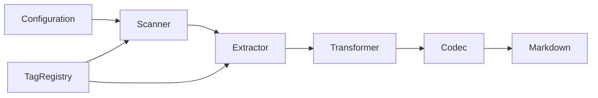

# Taxonomy Reference

**Purpose:** Tag taxonomy configuration for code-first documentation
**Detail Level:** Overview with links to details

---

## Overview

**21 categories** | **60 metadata tags** | **3 aggregation tags**

Current configuration uses `@architect-` prefix with `@architect` file opt-in.

| Component        | Count | Description                          |
| ---------------- | ----- | ------------------------------------ |
| Categories       | 21    | Pattern classification by domain     |
| Metadata Tags    | 60    | Pattern enrichment and relationships |
| Aggregation Tags | 3     | Document routing                     |

---

## Categories

Domain classifications for organizing patterns by priority.

| Tag               | Domain               | Priority | Description                                    |
| ----------------- | -------------------- | -------- | ---------------------------------------------- |
| `domain`          | Strategic DDD        | 1        | Bounded contexts, aggregates, strategic design |
| `ddd`             | Domain-Driven Design | 2        | DDD tactical patterns                          |
| `bounded-context` | Bounded Context      | 3        | BC contracts and definitions                   |
| `event-sourcing`  | Event Sourcing       | 4        | Event store, aggregates, replay                |
| `decider`         | Decider              | 5        | Decider pattern                                |
| `fsm`             | FSM                  | 5        | Finite state machine patterns                  |
| `cqrs`            | CQRS                 | 5        | Command/query separation                       |
| `projection`      | Projection           | 6        | Read models, checkpoints                       |
| `saga`            | Saga                 | 7        | Cross-context coordination, process managers   |
| `command`         | Command              | 8        | Command handlers, orchestration                |
| `arch`            | Architecture         | 9        | Architecture patterns, decisions               |
| `infra`           | Infrastructure       | 10       | Infrastructure, composition root               |
| `validation`      | Validation           | 11       | Input validation, schemas                      |
| `testing`         | Testing              | 12       | Test patterns, BDD                             |
| `performance`     | Performance          | 13       | Optimization, caching                          |
| `security`        | Security             | 14       | Auth, authorization                            |
| `core`            | Core                 | 15       | Core utilities                                 |
| `api`             | API                  | 16       | Public APIs                                    |
| `generator`       | Generator            | 17       | Code generators                                |
| `middleware`      | Middleware           | 18       | Middleware patterns                            |
| `correlation`     | Correlation          | 19       | Correlation tracking                           |

[Full category reference](taxonomy/categories.md)

---

## Metadata Tags

Tags for enriching patterns with additional metadata.

### Core Tags

| Tag       | Format       | Purpose                                      | Required | Example                                               |
| --------- | ------------ | -------------------------------------------- | -------- | ----------------------------------------------------- |
| `pattern` | value        | Explicit pattern name                        | Yes      | `@architect-pattern CommandOrchestrator`              |
| `status`  | enum         | Work item lifecycle status (per PDR-005 FSM) | No       | `@architect-status roadmap`                           |
| `core`    | flag         | Marks as essential/must-know pattern         | No       | `@architect-core`                                     |
| `usecase` | quoted-value | Use case association                         | No       | `@architect-usecase "When handling command failures"` |

### Relationship Tags

| Tag          | Format | Purpose                                                                    | Required | Example                                                                |
| ------------ | ------ | -------------------------------------------------------------------------- | -------- | ---------------------------------------------------------------------- |
| `uses`       | csv    | Patterns this depends on                                                   | No       | `@architect-uses CommandBus, EventStore`                               |
| `used-by`    | csv    | Patterns that depend on this                                               | No       | `@architect-used-by SagaOrchestrator`                                  |
| `depends-on` | csv    | Roadmap dependencies (pattern or phase names)                              | No       | `@architect-depends-on EventStore, CommandBus`                         |
| `enables`    | csv    | Patterns this enables                                                      | No       | `@architect-enables SagaOrchestrator, ProjectionBuilder`               |
| `implements` | csv    | Patterns this code file realizes (realization relationship)                | No       | `@architect-implements EventStoreDurability, IdempotentAppend`         |
| `extends`    | value  | Base pattern this pattern extends (generalization relationship)            | No       | `@architect-extends ProjectionCategories`                              |
| `see-also`   | csv    | Related patterns for cross-reference without dependency implication        | No       | `@architect-see-also AgentAsBoundedContext, CrossContextIntegration`   |
| `api-ref`    | csv    | File paths to implementation APIs (replaces 'See:' Markdown text in Rules) | No       | `@architect-api-ref @libar-dev/platform-core/src/durability/outbox.ts` |

### Timeline Tags

| Tag             | Format | Purpose                                                      | Required | Example                              |
| --------------- | ------ | ------------------------------------------------------------ | -------- | ------------------------------------ |
| `phase`         | number | Roadmap phase number (unified across monorepo)               | No       | `@architect-phase 14`                |
| `release`       | value  | Target release version (semver or vNEXT for unreleased work) | No       | `@architect-release v0.1.0`          |
| `quarter`       | value  | Delivery quarter for timeline tracking                       | No       | `@architect-quarter Q1-2026`         |
| `completed`     | value  | Completion date (YYYY-MM-DD format)                          | No       | `@architect-completed 2026-01-08`    |
| `effort`        | value  | Estimated effort (4h, 2d, 1w format)                         | No       | `@architect-effort 2d`               |
| `effort-actual` | value  | Actual effort spent (4h, 2d, 1w format)                      | No       | `@architect-effort-actual 3d`        |
| `team`          | value  | Responsible team assignment                                  | No       | `@architect-team platform`           |
| `workflow`      | enum   | Workflow discipline for process tracking                     | No       | `@architect-workflow implementation` |
| `risk`          | enum   | Risk level for planning                                      | No       | `@architect-risk medium`             |
| `priority`      | enum   | Priority level for roadmap ordering                          | No       | `@architect-priority high`           |

### ADR Tags

| Tag                 | Format | Purpose                                               | Required | Example                                |
| ------------------- | ------ | ----------------------------------------------------- | -------- | -------------------------------------- |
| `adr`               | value  | ADR/PDR number for decision tracking                  | No       | `@architect-adr 015`                   |
| `adr-status`        | enum   | ADR/PDR decision status                               | No       | `@architect-adr-status accepted`       |
| `adr-category`      | value  | ADR/PDR category (architecture, process, tooling)     | No       | `@architect-adr-category architecture` |
| `adr-supersedes`    | value  | ADR/PDR number this decision supersedes               | No       | `@architect-adr-supersedes 012`        |
| `adr-superseded-by` | value  | ADR/PDR number that supersedes this decision          | No       | `@architect-adr-superseded-by 020`     |
| `adr-theme`         | enum   | Theme grouping for related decisions (from synthesis) | No       | `@architect-adr-theme persistence`     |
| `adr-layer`         | enum   | Evolutionary layer of the decision                    | No       | `@architect-adr-layer foundation`      |

### Architecture Tags

| Tag            | Format | Purpose                                                           | Required | Example                             |
| -------------- | ------ | ----------------------------------------------------------------- | -------- | ----------------------------------- |
| `arch-role`    | enum   | Architectural role for diagram generation (component type)        | No       | `@architect-arch-role projection`   |
| `arch-context` | value  | Bounded context this component belongs to (for subgraph grouping) | No       | `@architect-arch-context orders`    |
| `arch-layer`   | enum   | Architectural layer for layered diagrams                          | No       | `@architect-arch-layer application` |

### Other Tags

| Tag                      | Format       | Purpose                                                                    | Required | Example                                                                      |
| ------------------------ | ------------ | -------------------------------------------------------------------------- | -------- | ---------------------------------------------------------------------------- |
| `brief`                  | value        | Path to pattern brief markdown                                             | No       | `@architect-brief docs/briefs/decider-pattern.md`                            |
| `product-area`           | value        | Product area for PRD grouping                                              | No       | `@architect-product-area PlatformCore`                                       |
| `user-role`              | value        | Target user persona for this feature                                       | No       | `@architect-user-role Developer`                                             |
| `business-value`         | value        | Business value statement (hyphenated for tag format)                       | No       | `@architect-business-value eliminates-event-replay-complexity`               |
| `constraint`             | value        | Technical constraint affecting feature implementation                      | No       | `@architect-constraint requires-convex-backend`                              |
| `level`                  | enum         | Hierarchy level for epic->phase->task breakdown                            | No       | `@architect-level epic`                                                      |
| `parent`                 | value        | Parent pattern name in hierarchy (links tasks to phases, phases to epics)  | No       | `@architect-parent AggregateArchitecture`                                    |
| `title`                  | quoted-value | Human-readable display title (supports quoted values with spaces)          | No       | `@architect-title:"Process Guard Linter"`                                    |
| `executable-specs`       | csv          | Links roadmap spec to package executable spec locations (PDR-007)          | No       | `@architect-executable-specs platform-decider/tests/features/behavior`       |
| `roadmap-spec`           | value        | Links package spec back to roadmap pattern for traceability (PDR-007)      | No       | `@architect-roadmap-spec DeciderPattern`                                     |
| `behavior-file`          | value        | Path to behavior test feature file for traceability                        | No       | `@architect-behavior-file behavior/my-pattern.feature`                       |
| `discovered-gap`         | value        | Gap identified during session retrospective                                | No       | `@architect-discovered-gap missing-error-handling`                           |
| `discovered-improvement` | value        | Improvement identified during session retrospective                        | No       | `@architect-discovered-improvement cache-invalidation`                       |
| `discovered-risk`        | value        | Risk identified during session retrospective                               | No       | `@architect-discovered-risk data-loss-on-migration`                          |
| `discovered-learning`    | value        | Learning captured during session retrospective                             | No       | `@architect-discovered-learning convex-mutation-limits`                      |
| `extract-shapes`         | csv          | TypeScript type names to extract from this file for documentation          | No       | `@architect-extract-shapes DeciderInput, ValidationResult, ProcessViolation` |
| `shape`                  | value        | Marks declaration as documentable shape, optionally with group name        | No       | `@architect-shape api-types`                                                 |
| `include`                | csv          | Cross-cutting document inclusion for content routing and diagram scoping   | No       | `@architect-include reference-sample,codec-system`                           |
| `target`                 | value        | Target implementation path for stub files                                  | No       | `@architect-target src/api/stub-resolver.ts`                                 |
| `since`                  | value        | Design session that created this pattern                                   | No       | `@architect-since DS-A`                                                      |
| `convention`             | csv          | Convention domains for reference document generation from decision records | No       | `@architect-convention fsm-rules, testing-policy`                            |
| `claude-module`          | value        | Module identifier for CLAUDE.md module generation (becomes filename)       | No       | `@architect-claude-module process-guard`                                     |
| `claude-section`         | enum         | Target section directory in \_claude-md/ for module output                 | No       | `@architect-claude-section process`                                          |
| `claude-tags`            | csv          | Variation filtering tags for modular-claude-md inclusion                   | No       | `@architect-claude-tags core-mandatory, process`                             |
| `sequence-orchestrator`  | value        | Identifies the coordinator module for sequence diagram generation          | No       | `@architect-sequence-orchestrator:init-cli`                                  |
| `sequence-step`          | number       | Explicit execution ordering number for sequence diagram steps              | No       | `@architect-sequence-step:1`                                                 |
| `sequence-module`        | csv          | Maps Rule to deliverable module(s) for sequence diagram participants       | No       | `@architect-sequence-module:detect-context`                                  |
| `sequence-error`         | flag         | Marks scenario as error/alternative path in sequence diagram               | No       | `@architect-sequence-error`                                                  |

[Full metadata tag reference](taxonomy/metadata-tags.md)

---

## Aggregation Tags

Tags that route patterns to specific aggregated documents.

| Tag        | Target Document | Purpose                                     |
| ---------- | --------------- | ------------------------------------------- |
| `overview` | OVERVIEW.md     | Architecture overview patterns              |
| `decision` | DECISIONS.md    | ADR-style decisions (auto-numbered)         |
| `intro`    | None            | Package introduction (template placeholder) |

---

## Format Types

How tag values are parsed and validated.

| Format         | Description                         | Example                               |
| -------------- | ----------------------------------- | ------------------------------------- |
| `value`        | Simple string value                 | `@architect-pattern MyPattern`        |
| `enum`         | Constrained to predefined values    | `@architect-status roadmap`           |
| `quoted-value` | String in quotes (preserves spaces) | `@architect-usecase "When X happens"` |
| `csv`          | Comma-separated values              | `@architect-uses A, B, C`             |
| `number`       | Numeric value                       | `@architect-phase 14`                 |
| `flag`         | Boolean presence (no value)         | `@architect-core`                     |

[Format type details](taxonomy/format-types.md)

---

## Presets

Available configuration presets.

| Preset          | Tag Prefix    | Categories | Use Case                               |
| --------------- | ------------- | ---------- | -------------------------------------- |
| `libar-generic` | `@architect-` | 3          | Default preset with @architect- prefix |
| `ddd-es-cqrs`   | `@architect-` | 21         | Full DDD/ES/CQRS taxonomy              |

---

## Architecture

Taxonomy source files and pipeline flow.

```plaintext
src/taxonomy/
├── categories.ts          # Category definitions (21 DDD-ES-CQRS)
├── format-types.ts        # Format type constants
├── registry-builder.ts    # Single source of truth builder
├── status-values.ts       # Status FSM values
├── generator-options.ts   # Generator option values
├── hierarchy-levels.ts    # Hierarchy level values
├── risk-levels.ts         # Risk level values
└── index.ts               # Barrel export
```



---
