# Component Topology

**Purpose:** Reference document: Component Topology
**Detail Level:** Full reference

---

## Component Topology

Scoped architecture diagram showing component relationships:

```mermaid
graph TB
    subgraph agent["Agent"]
        Churn_Risk_Agent_Configuration[/"Churn Risk Agent Configuration"/]
        AgentOnCompleteHandler[/"AgentOnCompleteHandler"/]
        AgentActionHandler(["AgentActionHandler"])
    end
    subgraph inventory["Inventory"]
        ProductCatalogProjection[("ProductCatalogProjection")]
        ActiveReservationsProjection[("ActiveReservationsProjection")]
        InventoryCommandConfigs[/"InventoryCommandConfigs"/]
        InventoryCommandHandlers(["InventoryCommandHandlers"])
    end
    subgraph orders["Orders"]
        ReservationReleasePM{{"ReservationReleasePM"}}
        OrderNotificationPM{{"OrderNotificationPM"}}
        OrderSummaryProjection[("OrderSummaryProjection")]
        OrderCommandConfigs[/"OrderCommandConfigs"/]
        OrderCommandHandlers(["OrderCommandHandlers"])
    end
    OrderManagementInfrastructure[/"OrderManagementInfrastructure"/]
    EventSubscriptionRegistry[/"EventSubscriptionRegistry"/]
    OrderFulfillmentSaga{{"OrderFulfillmentSaga"}}
    subgraph related["Related"]
        EventStore["EventStore"]:::neighbor
        CommandBus["CommandBus"]:::neighbor
        OrderItemsProjection["OrderItemsProjection"]:::neighbor
        CustomerCancellationsProjection["CustomerCancellationsProjection"]:::neighbor
        OrderWithInventoryProjection["OrderWithInventoryProjection"]:::neighbor
        OrderDeciders["OrderDeciders"]:::neighbor
        InventoryDeciders["InventoryDeciders"]:::neighbor
        AgentLLMIntegration["AgentLLMIntegration"]:::neighbor
        AgentBCComponentIsolation["AgentBCComponentIsolation"]:::neighbor
        AgentAsBoundedContext["AgentAsBoundedContext"]:::neighbor
    end
    OrderManagementInfrastructure -->|uses| EventStore
    OrderManagementInfrastructure -->|uses| CommandBus
    EventSubscriptionRegistry -->|uses| OrderNotificationPM
    EventSubscriptionRegistry -->|uses| ReservationReleasePM
    EventSubscriptionRegistry -->|uses| AgentAsBoundedContext
    EventSubscriptionRegistry -->|uses| AgentLLMIntegration
    OrderFulfillmentSaga -->|uses| OrderCommandHandlers
    OrderFulfillmentSaga -->|uses| InventoryCommandHandlers
    ReservationReleasePM -->|uses| InventoryCommandHandlers
    ReservationReleasePM -->|uses| OrderWithInventoryProjection
    OrderNotificationPM -->|uses| OrderCommandHandlers
    OrderSummaryProjection -->|uses| EventStore
    ProductCatalogProjection -->|uses| InventoryCommandHandlers
    ActiveReservationsProjection -->|uses| InventoryCommandHandlers
    Churn_Risk_Agent_Configuration -->|uses| AgentAsBoundedContext
    OrderCommandConfigs -->|uses| OrderSummaryProjection
    OrderCommandConfigs -->|uses| OrderWithInventoryProjection
    OrderCommandConfigs -->|uses| OrderItemsProjection
    OrderCommandConfigs -->|uses| CustomerCancellationsProjection
    InventoryCommandConfigs -->|uses| ActiveReservationsProjection
    InventoryCommandConfigs -->|uses| ProductCatalogProjection
    InventoryCommandConfigs -->|uses| OrderWithInventoryProjection
    OrderCommandHandlers -->|uses| OrderDeciders
    InventoryCommandHandlers -->|uses| InventoryDeciders
    AgentOnCompleteHandler -->|uses| AgentAsBoundedContext
    AgentOnCompleteHandler -->|uses| AgentLLMIntegration
    AgentActionHandler -->|uses| AgentLLMIntegration
    AgentActionHandler -->|uses| AgentBCComponentIsolation
    OrderItemsProjection -->|uses| OrderCommandHandlers
    CustomerCancellationsProjection -->|uses| OrderCommandHandlers
    OrderWithInventoryProjection -->|uses| OrderCommandHandlers
    OrderWithInventoryProjection -->|uses| InventoryCommandHandlers
    AgentLLMIntegration -.->|depends on| AgentBCComponentIsolation
    AgentBCComponentIsolation -.->|depends on| AgentAsBoundedContext
    classDef neighbor stroke-dasharray: 5 5
```



---

## API Types

### OrderFulfillmentArgs (interface)

```typescript
/**
 * Saga arguments (what triggers the saga).
 */
```

```typescript
interface OrderFulfillmentArgs {
  orderId: string;
  customerId: string;
  items: Array<{
    productId: string;
    productName: string;
    quantity: number;
    unitPrice: number;
  }>;
  totalAmount: number;
  /** Correlation ID from triggering event for distributed tracing */
  correlationId: string;
}
```

| Property      | Description                                                  |
| ------------- | ------------------------------------------------------------ |
| correlationId | Correlation ID from triggering event for distributed tracing |

### OrderFulfillmentResult (interface)

```typescript
/**
 * Saga result.
 */
```

```typescript
interface OrderFulfillmentResult {
  status: "completed" | "compensated";
  reservationId?: string;
  reason?: string;
}
```

### CHURN_RISK_AGENT_ID (const)

```typescript
/**
 * Agent identifier used for checkpoints, subscriptions, and audit.
 */
```

```typescript
CHURN_RISK_AGENT_ID = "churn-risk-agent" as const;
```

### CHURN_RISK_SUBSCRIPTIONS (const)

```typescript
/**
 * Event types the churn risk agent subscribes to.
 */
```

```typescript
CHURN_RISK_SUBSCRIPTIONS = [
  "OrderCancelled",
  // Future: "OrderRefunded", "OrderComplaintFiled"
] as const;
```

### churnRiskAgentConfig (const)

````typescript
/**
 * Churn risk agent configuration.
 *
 * Detects customer churn risk by analyzing cancellation patterns:
 * - Window: 30 days
 * - Trigger: 3+ cancellation events
 * - Confidence threshold: 0.8 for auto-execution
 *
 * @example
 * ```typescript
 * // Use in subscription registration
 * const subscription = createAgentSubscription(churnRiskAgentConfig, {
 *   actionHandler: internal.contexts.agent.handlers.analyzeEvent.analyzeChurnRiskEvent,
 * });
 * ```
 */
````

```typescript
const churnRiskAgentConfig: AgentBCConfig;
```

---
