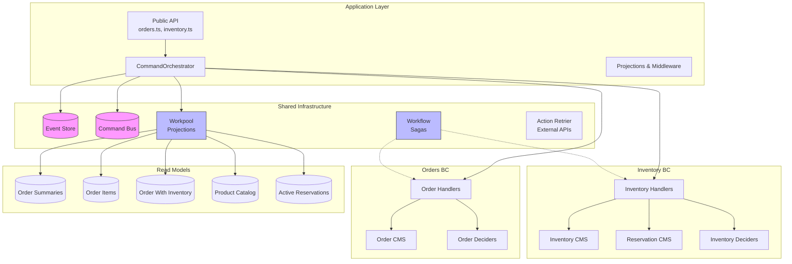
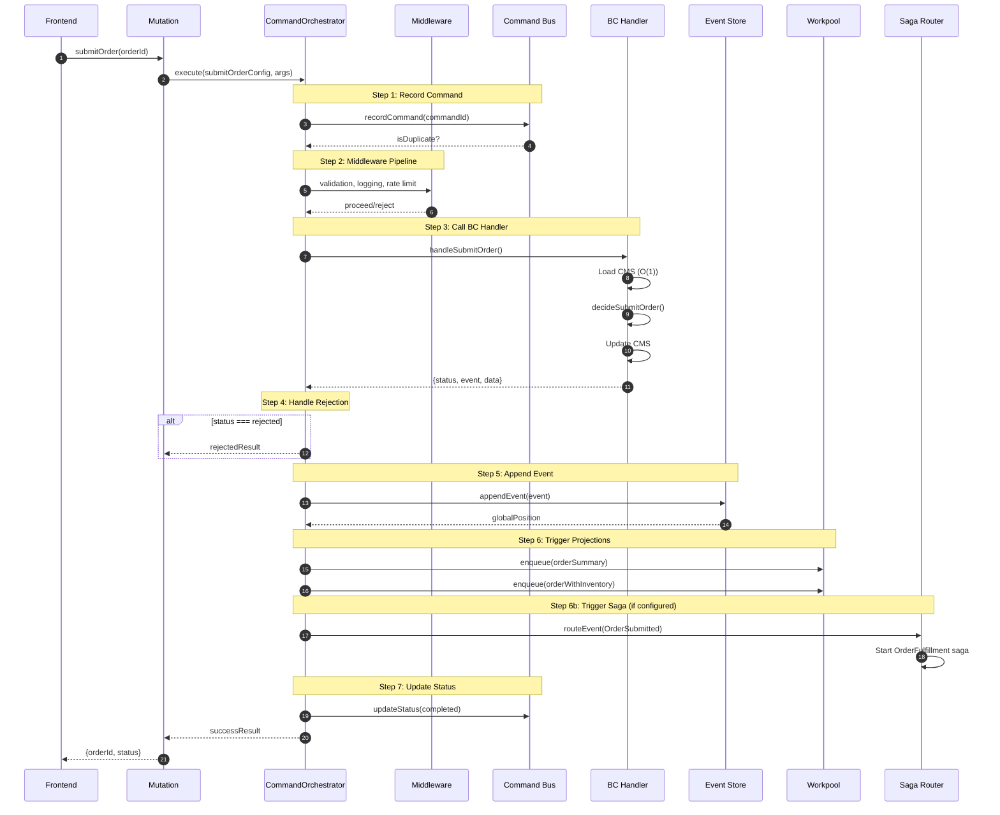
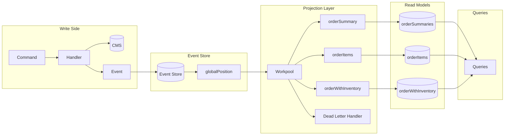
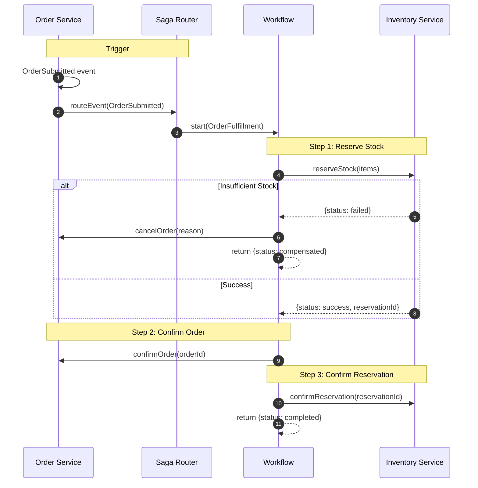

<!--
@libar-docs
@libar-docs-pattern ExampleAppArchitecture
@libar-docs-status completed
@libar-docs-phase 23
@libar-docs-uses CommandOrchestrator, EventStore, Workpool, Workflow, DCB
@libar-docs-example-app
-->

# Order Management Example App Architecture

> Comprehensive architectural documentation for the order-management reference implementation demonstrating Convex-native DDD/ES/CQRS patterns.

---

## Table of Contents

1. [Executive Summary](#executive-summary)
2. [System Overview](#system-overview)
3. [Component Architecture](#component-architecture)
4. [Layered Architecture](#layered-architecture)
5. [Command Flow](#command-flow)
6. [Event Flow and Projections](#event-flow-and-projections)
7. [Saga and Process Manager Patterns](#saga-and-process-manager-patterns)
8. [Key Abstractions](#key-abstractions)
9. [Design Decisions](#design-decisions)
10. [Appendices](#appendices)

---

## Executive Summary

The order-management example app demonstrates the "Third Way" - a Convex-native approach to Domain-Driven Design with Event Sourcing that differs fundamentally from traditional implementations:

| Aspect                    | Traditional ES                   | This Implementation          |
| ------------------------- | -------------------------------- | ---------------------------- |
| State Recovery            | O(n) event replay                | O(1) CMS snapshot            |
| Bounded Context Isolation | Logical (naming conventions)     | Physical (Convex components) |
| Orchestration             | External tools (Kafka, RabbitMQ) | Built-in Workpool/Workflow   |
| Real-time Updates         | Polling (100ms-2s)               | Reactive push (10-50ms)      |
| Infrastructure            | Complex (multiple services)      | Convex-managed               |

**Key Innovation**: The dual-write pattern - CMS (Command Model State) and Event Store are updated atomically in the same mutation, providing O(1) state access while maintaining complete audit trail.

---

## System Overview

### Bounded Contexts

The application implements three bounded contexts, each as a physically isolated Convex component:



### Component Isolation

Each BC has an **isolated database** - the parent app cannot query BC tables directly:

```typescript
// FAILS - table doesn't exist in parent context
ctx.db.query("orderCMS");

// WORKS - must call through component API
ctx.runMutation(components.orders.handlers.commands.handleCreateOrder, args);
```

This isolation provides:

- **Strong boundaries**: No accidental coupling between BCs
- **Independent deployment**: Components can be versioned separately
- **Transaction isolation**: Component throws are isolated rollbacks

---

## Layered Architecture

The application follows a strict layered architecture, as documented in `inventoryInternal.ts`:

```
+-----------------------------------------------------------------------+
|  APP LEVEL (Infrastructure Layer)                                      |
|  +-- Retry Infrastructure (withDCBRetry)                               |
|  +-- Rate Limiting (middleware)                                        |
|  +-- Observability (logging, dead letters)                             |
|                           |                                            |
|                           v                                            |
|  +-------------------------------------------------------------------+ |
|  |  COMMAND ORCHESTRATOR (Application Service)                        | |
|  |  +-- Command idempotency (Command Bus)                             | |
|  |  +-- Dual-write coordination (CMS + Event Store)                   | |
|  |  +-- Projection triggering (Workpool)                              | |
|  |                           |                                        | |
|  |                           v                                        | |
|  |  +---------------------------------------------------------------+ | |
|  |  |  BC COMPONENT (Domain Layer)                                   | | |
|  |  |  +-- Deciders (pure business logic)                            | | |
|  |  |  +-- CMS State Management                                      | | |
|  |  |  +-- DCB Multi-Entity Validation                               | | |
|  |  +---------------------------------------------------------------+ | |
|  +-------------------------------------------------------------------+ |
+-----------------------------------------------------------------------+
```

### Layer Responsibilities

| Layer                   | Responsibility                                     | Location                                                                       |
| ----------------------- | -------------------------------------------------- | ------------------------------------------------------------------------------ |
| **Infrastructure**      | Retry, rate limiting, logging, dead letters        | `convex/infrastructure.ts`, `convex/inventoryInternal.ts`                      |
| **Application Service** | Command orchestration, dual-write, projections     | `@libar-dev/platform-core/CommandOrchestrator`                                 |
| **Domain**              | Pure business logic, state transitions, invariants | `convex/contexts/*/handlers/commands.ts`, `convex/contexts/*/domain/deciders/` |

### Why Retry Lives at App Level

1. **Separation of Concerns**: Retry is infrastructure, not business logic
2. **Component Isolation Constraint**: BC components cannot self-reference via `internal.xxx` API
3. **Hexagonal Architecture**: Infrastructure adapters wrap around the domain, not inside it

---

## Command Flow

### The 7-Step CommandOrchestrator

Every command follows this exact flow:



### Command Configuration

Each command is defined via a `CommandConfig` that wires together:

```typescript
// From commands/orders/configs.ts
export const submitOrderConfig: CommandConfig<...> = {
  commandType: "SubmitOrder",
  boundedContext: "orders",
  handler: components.orders.handlers.commands.handleSubmitOrder,
  toHandlerArgs: (args, commandId, correlationId) => ({...}),
  projection: {
    handler: orderSummaryOnSubmitted,
    onComplete: deadLetterOnComplete,
    projectionName: "orderSummary",
    toProjectionArgs: (...) => ({...}),
    getPartitionKey: (args) => ({ name: "orderId", value: args.orderId }),
  },
  secondaryProjections: [...],
  sagaRoute: {
    router: sagaRouter,
    getEventType: () => "OrderSubmitted",
  },
};
```

### Handler Patterns

Two factory patterns for command handlers:

| Pattern                        | Use Case                             | Example                                    |
| ------------------------------ | ------------------------------------ | ------------------------------------------ |
| `createEntityDeciderHandler()` | Entity creation (null state allowed) | `handleCreateOrder`                        |
| `createDeciderHandler()`       | Modifications (state must exist)     | `handleAddOrderItem`, `handleConfirmOrder` |

Custom handlers are used when pre-decider enrichment is needed (e.g., `handleSubmitOrder` for Fat Events).

---

## Event Flow and Projections

### Data Flow Diagram



### Projection Handler Pattern

All projections use checkpoint-based idempotency:

```typescript
// From projections/orders/orderSummary.ts
export const onOrderCreated = internalMutation({
  args: {
    orderId: v.string(),
    customerId: v.string(),
    eventId: v.string(),
    globalPosition: v.number(),
  },
  handler: async (ctx, args) => {
    return withCheckpoint(ctx, PROJECTION_NAME, orderId, args, async () => {
      await ctx.db.insert("orderSummaries", {
        orderId,
        customerId,
        status: "draft",
        itemCount: 0,
        totalAmount: 0,
        createdAt: now,
        updatedAt: now,
        lastGlobalPosition: args.globalPosition,
      });
    });
  },
});
```

**Key Features**:

- `globalPosition` enables idempotency (skip if already processed)
- Partition keys ensure ordered processing per entity
- Dead letter handler captures failures for retry/investigation

### Projection Categories

| Category        | Purpose                        | Examples                         |
| --------------- | ------------------------------ | -------------------------------- |
| **View**        | UI rendering, instant feedback | `orderSummary`, `productCatalog` |
| **Integration** | Cross-BC data needs            | `orderWithInventory`             |
| **Logic**       | Trigger subsequent actions     | Saga routing                     |
| **Reporting**   | Analytics, aggregations        | (Future)                         |

---

## Saga and Process Manager Patterns

### Order Fulfillment Saga

The `OrderFulfillment` saga coordinates cross-BC operations:



### Saga Implementation

```typescript
// From sagas/orderFulfillment.ts
export const orderFulfillmentWorkflow = workflowManager.define({
  args: { orderId, customerId, items, totalAmount, correlationId },
  handler: async (ctx, args) => {
    // Step 1: Reserve inventory
    const reserveResult = await ctx.runMutation(reserveStockMutation, {
      orderId: args.orderId,
      items: args.items.map((item) => ({
        productId: item.productId,
        quantity: item.quantity,
      })),
    });

    // Handle failure with compensation
    if (reserveResult.status === "failed" || reserveResult.status === "rejected") {
      await ctx.runMutation(cancelOrderMutation, {
        orderId: args.orderId,
        reason: reserveResult.reason ?? "Inventory reservation failed",
      });
      return { status: "compensated", reason };
    }

    // Success path
    await ctx.runMutation(confirmOrderMutation, { orderId });
    if (reservationId) {
      await ctx.runMutation(confirmReservationMutation, { reservationId });
    }

    return { status: "completed", reservationId };
  },
});
```

### Saga vs Process Manager Decision

```
Need compensation? ---------> Yes --> Saga (@convex-dev/workflow)
        |
       No
        v
Multi-step with await? -----> Yes --> Saga
        |
       No
        v
Simple event --> command? --> Process Manager (Workpool + EventBus)
```

---

## Key Abstractions

| Abstraction              | Purpose                                    | Location                          | Dependencies                     |
| ------------------------ | ------------------------------------------ | --------------------------------- | -------------------------------- |
| **CommandOrchestrator**  | 7-step command execution flow              | `@libar-dev/platform-core`        | EventStore, CommandBus, Workpool |
| **EventStore**           | Append-only event persistence              | `@libar-dev/platform-store`       | Convex component                 |
| **CommandBus**           | Command idempotency, correlation tracking  | `@libar-dev/platform-bus`         | Convex component                 |
| **Workpool**             | Projection scheduling, parallelism control | `@convex-dev/workpool`            | -                                |
| **Workflow**             | Durable saga execution                     | `@convex-dev/workflow`            | Workpool                         |
| **Decider**              | Pure business logic function               | `@libar-dev/platform-decider`     | -                                |
| **CMS Repository**       | O(1) state loading with upcasting          | `convex/contexts/*/repository.ts` | -                                |
| **CommandConfig**        | Declarative command wiring                 | `convex/commands/*/configs.ts`    | Handler, Projections             |
| **MiddlewarePipeline**   | Cross-cutting concerns                     | `infrastructure.ts`               | RateLimiter, Logger              |
| **DCB (executeWithDCB)** | Multi-entity atomic operations             | `@libar-dev/platform-core/dcb`    | -                                |
| **withDCBRetry**         | OCC conflict retry scheduling              | `@libar-dev/platform-core/dcb`    | Workpool                         |

### Infrastructure Setup

```typescript
// From infrastructure.ts
export const projectionPool = new Workpool(components.projectionPool, {
  maxParallelism: workpoolParallelism, // 3-10 based on environment
  defaultRetryBehavior: { maxAttempts: 3, initialBackoffMs: 250, base: 2 },
});

export const workflowManager = new WorkflowManager(components.workflow, {
  workpoolOptions: { maxParallelism: workpoolParallelism },
});

export const middlewarePipeline = createMiddlewarePipeline()
  .use(createRegistryValidationMiddleware(commandRegistry))
  .use(createLoggingMiddleware({ logger, includeTiming: true }))
  .use(
    createRateLimitMiddleware({
      checkerFactory: (ctx) => createConvexRateLimitAdapter(rateLimiter)(ctx.raw),
      getKey: RateLimitKeys.byUserAndCommand(),
    })
  );

export const commandOrchestrator = new CommandOrchestrator({
  eventStore,
  commandBus,
  projectionPool,
  eventBus,
  defaultOnComplete: deadLetterOnComplete,
  middlewarePipeline,
});
```

---

## Design Decisions

### ADR-001: Dual-Write Pattern

**Context**: Traditional ES requires O(n) event replay to recover state.

**Decision**: Maintain CMS (snapshot) alongside events, updated atomically.

**Consequences**:

- (+) O(1) state access always
- (+) Events remain source of truth for audit/rebuild
- (-) Two writes per mutation (mitigated by Convex atomicity)

### ADR-002: Physical BC Isolation via Components

**Context**: Logical boundaries can erode over time.

**Decision**: Each BC is a Convex component with isolated database.

**Consequences**:

- (+) Impossible to accidentally query across BCs
- (+) Clear API boundaries
- (-) Cannot share tables (requires projections)
- (-) Complex ID serialization at boundaries

### ADR-003: Projections at App Level

**Context**: Where should projection handlers live?

**Decision**: All projections at app level, never in BC components.

**Rationale**: Components have isolated databases. Projections often need data from multiple BCs (e.g., `orderWithInventory`).

### ADR-004: Workpool for Projections

**Context**: How to process projections reliably?

**Decision**: Use Workpool with partition keys.

**Benefits**:

- Partition keys ensure per-entity ordering
- Built-in retry with exponential backoff
- Dead letter handler for failures
- Parallelism control reduces OCC conflicts

### ADR-005: Sagas via Workflow Component

**Context**: How to coordinate cross-BC operations?

**Decision**: Use `@convex-dev/workflow` for durable sagas.

**Benefits**:

- Survives server restarts
- Built-in step durability
- Can await external events
- Compensation logic is explicit

---

## Appendices

### A. File Structure

```
convex/
+-- infrastructure.ts          # Workpool, Workflow, Orchestrator setup
+-- inventoryInternal.ts       # DCB retry pattern example
|
+-- commands/
|   +-- registry.ts            # Command registration with schemas
|   +-- orders/configs.ts      # Order command configurations
|   +-- inventory/configs.ts   # Inventory command configurations
|
+-- contexts/
|   +-- orders/
|   |   +-- handlers/commands.ts   # BC command handlers
|   |   +-- domain/deciders/       # Pure business logic
|   |   +-- repository.ts          # CMS loading with upcast
|   +-- inventory/
|       +-- handlers/commands.ts
|       +-- domain/deciders/
|       +-- repository.ts
|
+-- projections/
|   +-- orders/orderSummary.ts     # Order summary read model
|   +-- orders/orderItems.ts       # Order items read model
|   +-- inventory/productCatalog.ts
|   +-- crossContext/orderWithInventory.ts
|   +-- deadLetters.ts             # Failure handling
|   +-- _helpers.ts                # withCheckpoint utility
|
+-- sagas/
|   +-- router.ts                  # Event to saga routing
|   +-- registry.ts                # Saga idempotency
|   +-- orderFulfillment.ts        # Order fulfillment saga
|
+-- integration/
    +-- routes.ts                  # Cross-BC integration events
```

### B. Command Registry

All commands are registered with metadata for validation and introspection:

| Command            | Bounded Context | Category  | Target Aggregate |
| ------------------ | --------------- | --------- | ---------------- |
| CreateOrder        | orders          | aggregate | Order            |
| AddOrderItem       | orders          | aggregate | Order            |
| RemoveOrderItem    | orders          | aggregate | Order            |
| SubmitOrder        | orders          | aggregate | Order            |
| ConfirmOrder       | orders          | aggregate | Order            |
| CancelOrder        | orders          | aggregate | Order            |
| CreateProduct      | inventory       | aggregate | Inventory        |
| AddStock           | inventory       | aggregate | Inventory        |
| ReserveStock       | inventory       | aggregate | Reservation      |
| ConfirmReservation | inventory       | aggregate | Reservation      |
| ReleaseReservation | inventory       | aggregate | Reservation      |
| ExpireReservation  | inventory       | system    | Reservation      |

### C. Event Types

| Event                | Stream Type | Payload Fields                                            |
| -------------------- | ----------- | --------------------------------------------------------- |
| OrderCreated         | Order       | orderId, customerId                                       |
| OrderItemAdded       | Order       | orderId, item, itemCount, totalAmount                     |
| OrderItemRemoved     | Order       | orderId, productId, itemCount, totalAmount                |
| OrderSubmitted       | Order       | orderId, customerId, items, totalAmount, customerSnapshot |
| OrderConfirmed       | Order       | orderId                                                   |
| OrderCancelled       | Order       | orderId, reason                                           |
| ProductCreated       | Inventory   | productId, productName, sku, unitPrice                    |
| StockAdded           | Inventory   | productId, quantity, reason, newQuantity                  |
| StockReserved        | Reservation | reservationId, orderId, items, expiresAt                  |
| ReservationFailed    | Reservation | orderId, reason, failedItems                              |
| ReservationConfirmed | Reservation | reservationId, orderId                                    |
| ReservationReleased  | Reservation | reservationId, orderId, reason                            |
| ReservationExpired   | Reservation | reservationId, orderId                                    |

### D. Related Documentation

- [COMPONENT_ISOLATION.md](../../../docs/architecture/COMPONENT_ISOLATION.md) - Convex component isolation details
- [dcb-architecture.md](../../packages/platform-core/docs/dcb-architecture.md) - Dynamic Consistency Boundaries
- [reactive-projections.md](../../packages/platform-core/docs/reactive-projections.md) - Real-time projection patterns
- [fat-events.md](../../packages/platform-core/docs/fat-events.md) - Event enrichment patterns
- [durable-function-adapters.md](../../packages/platform-core/docs/durable-function-adapters.md) - Retry and rate limiting patterns
- [CONVEX-DURABILITY-REFERENCE.md](../../../docs/architecture/CONVEX-DURABILITY-REFERENCE.md) - Workpool/Workflow/Retrier guide

---

_Document generated for Phase 23 - Example App Architecture Documentation_
