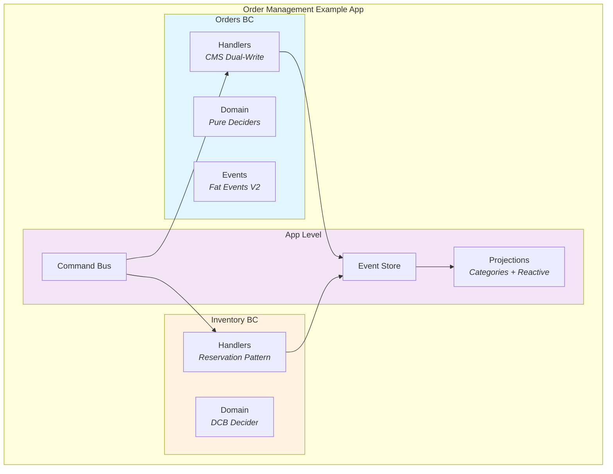

# Order Management

> **Reference Implementation** for the @libar-dev platform.
> For learning platform patterns, not production use.

## Purpose

This example app exists to **serve platform development** ([ADR-008](../../docs-living/decisions/adr-008-pdr-008-example-app-purpose.md)):

| Principle       | Description                                                              |
| --------------- | ------------------------------------------------------------------------ |
| Development Aid | Consumer for platform development and testing, not a production app      |
| Reference-Grade | Best possible architecture to demonstrate and test platform capabilities |
| Platform-Driven | Features selected to serve platform development needs                    |

**This is NOT a production application.** It demonstrates how platform patterns work together in realistic scenarios.

## Patterns Demonstrated

| Pattern               | Phase | Code                                                                                       | Documentation                                                                   |
| --------------------- | ----- | ------------------------------------------------------------------------------------------ | ------------------------------------------------------------------------------- |
| CMS Dual-Write        | 02    | [`commands.ts`](convex/contexts/orders/handlers/commands.ts)                               | [ADR-001](../../../docs/architecture/decisions/ADR-001-dual-write-pattern.md)   |
| Pure Deciders         | 14    | [`createOrder.ts`](convex/contexts/orders/domain/deciders/createOrder.ts)                  | [CLAUDE.md](../../../CLAUDE.md#pure-deciders-replace-aggregates)                |
| Projection Categories | 15    | [`definitions.ts`](convex/projections/definitions.ts)                                      | [PROJECTION-CATEGORIES.md](../../../docs/architecture/PROJECTION-CATEGORIES.md) |
| DCB                   | 16    | [`reserveMultipleDCB.ts`](convex/contexts/inventory/domain/deciders/reserveMultipleDCB.ts) | [DCB-ARCHITECTURE.md](../../../docs/architecture/DCB-ARCHITECTURE.md)           |
| Reactive Projections  | 17    | [`orderSummary.evolve.ts`](convex/projections/evolve/orderSummary.evolve.ts)               | [REACTIVE-PROJECTIONS.md](../../../docs/architecture/REACTIVE-PROJECTIONS.md)   |
| Fat Events            | 20    | [`events.ts`](convex/contexts/orders/domain/events.ts)                                     | [FAT-EVENTS.md](../../../docs/architecture/FAT-EVENTS.md)                       |
| Reservation Pattern   | 20    | [`reserveStock.ts`](convex/contexts/inventory/domain/deciders/reserveStock.ts)             | [RESERVATION-PATTERN.md](../../../docs/architecture/RESERVATION-PATTERN.md)     |

## Architecture



### Bounded Contexts

| Context          | Responsibility                              | Key Patterns                                |
| ---------------- | ------------------------------------------- | ------------------------------------------- |
| **Orders BC**    | Order lifecycle (create → submit → confirm) | Pure Deciders, Fat Events, CMS Dual-Write   |
| **Inventory BC** | Stock management and reservations           | DCB, Reservation Pattern                    |
| **App Level**    | Cross-context concerns                      | Projection Categories, Reactive Projections |

## Getting Started

### Prerequisites

- Node.js 18+
- pnpm 8+
- Docker (for integration tests)

### Local Development

```bash
# From repository root
pnpm install
pnpm start
```

| Service     | URL                   |
| ----------- | --------------------- |
| Backend API | http://127.0.0.1:3220 |
| Dashboard   | http://localhost:6791 |
| Frontend    | http://localhost:3000 |

### Running Tests

```bash
# Unit tests (mocked)
pnpm --filter order-management test:unit

# Integration tests (requires Docker)
pnpm --filter order-management test:integration
```

## Related Documentation

| Resource                                                                                           | Description                                 |
| -------------------------------------------------------------------------------------------------- | ------------------------------------------- |
| [Architecture Overview](../../../docs/architecture/OVERVIEW.md)                                    | Platform architecture and design principles |
| [ADR-008: Example App Purpose](../../docs-living/decisions/adr-008-pdr-008-example-app-purpose.md) | Why this app exists and decision criteria   |
| [CLAUDE.md](./CLAUDE.md)                                                                           | AI-optimized context for Claude Code        |
| [Component Isolation](../../../docs/architecture/COMPONENT_ISOLATION.md)                           | How BCs achieve physical isolation          |
